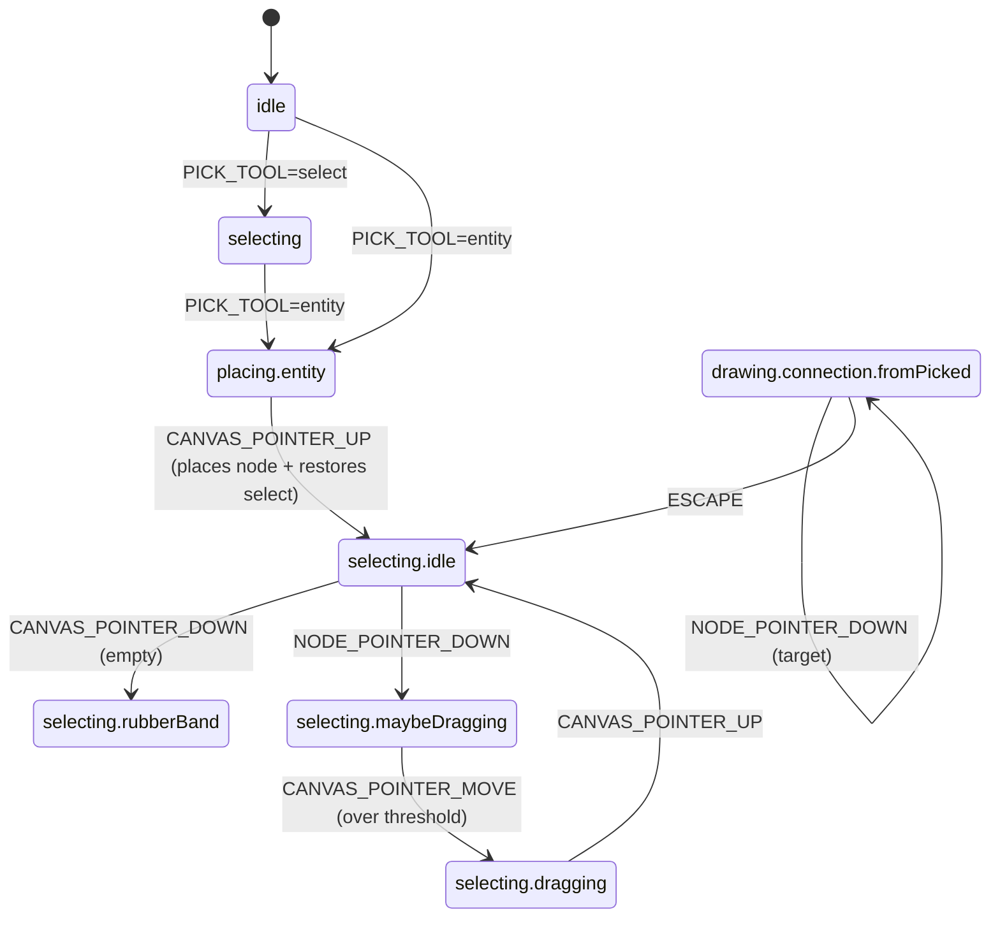

# Interaction FSM

The interaction layer (`src/interaction/`) is an XState v5 finite state machine. It owns:

- **What tool is active** (`select`, `pan`, `entity`, `relationship`, `attribute`, `connect`, etc.).
- **What's the next valid event** for the current state (clicking empty canvas while in `select.idle` starts a rubberband; in `placing.entity` it places a node).
- **Whether a drag is active**, and which kind (rubberband, single-node drag, resize, multi-node drag).

The machine is defined in `src/interaction/machine.ts` using `setup + createMachine`.

## EditorEvent — the event union

Every input layer (mouse, keyboard, touch, programmatic) emits `EditorEvent`s. The full union:

<<< ../../../src/interaction/events.ts#editor-event

Modifiers go on every pointer event:

<<< ../../../src/interaction/events.ts#modifiers

## States (high level)

The full chart in `machine.ts` is larger — this is just the spine. See the source for `quickRelationship.firstPicked`, `quickGeneralization.firstPicked`, `connectToGeneralization.waitingForChild`, `panning`, and the resize sub-states.

## Dispatching events

Three React hooks translate raw input into `EditorEvent`s:

- `useMouse` (`src/canvas/hooks/useMouse.ts`) — pointer events with `pointerType !== 'touch'`. Pen events flow through here.
- `useTouch` (`src/canvas/hooks/useTouch.ts`) — pointer events with `pointerType === 'touch'`. Implements the gesture state machine (long-press for rubberband, two-finger pinch/pan, palm rejection while pen is active).
- `useKeyboard` (`src/canvas/hooks/useKeyboard.ts`) — `keydown` listener; matches against `keybindings.ts` and dispatches the matched event.

All three hooks call `useInteractionStore.getState().send(event)`. The store wraps the actor; the actor runs the machine.

## Adding a new tool

See [Recipes: Add a tool](../recipes/add-tool).

## Where to next

- [API Reference](../../api/) — types and the event union are also surfaced there.
- [Recipes: Add a tool](../recipes/add-tool).
