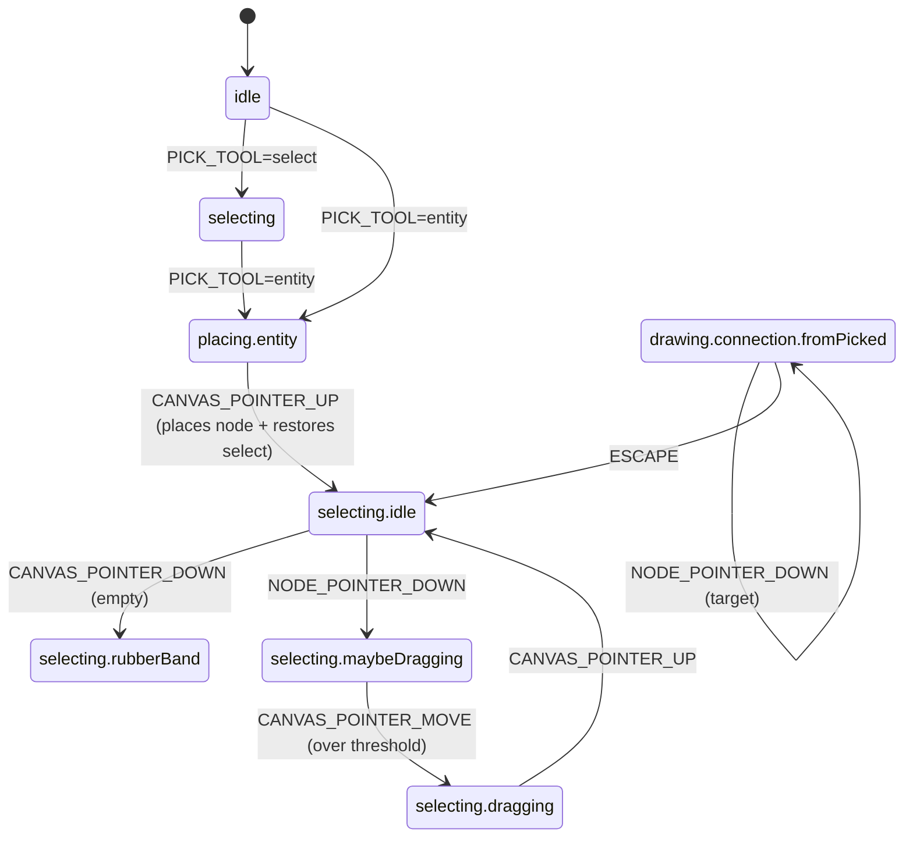

# Documentation Site Implementation Plan

> **For agentic workers:** REQUIRED SUB-SKILL: Use superpowers:subagent-driven-development (recommended) or superpowers:executing-plans to implement this plan task-by-task. Steps use checkbox (`- [ ]`) syntax for tracking.

**Goal:** Build the v2 documentation site (VitePress + TypeDoc + auto-generated keybindings table), port the Moodle postMessage bridge from legacy, and migrate stale root-level MDs into `docs/archive/`.

**Architecture:** VitePress static site under `docs/`, TypeDoc into `docs/api/` (gitignored), embedded code via region markers, build-time keybindings generator. Moodle bridge in `src/app/moodleBridge.ts` wired from `src/main.tsx`. Public-API barrels created at `src/domain/index.ts` and `src/notation/index.ts` so TypeDoc has stable entry points.

**Tech Stack:** VitePress 2.x, TypeDoc + `typedoc-plugin-markdown` + `typedoc-vitepress-theme`, `tsx` for the Node script, Vitest (existing) for the bridge tests.

**Branch:** Already on `chore/docs`. No worktree.

---

## File Structure

### Code

- Create: `src/app/moodleBridge.ts` — postMessage host bridge. Exports `installMoodleBridge(): () => void` and types `EditorOutgoing`, `EditorIncoming`.
- Create: `src/app/moodleBridge.test.ts` — full test suite per spec §5.7.
- Create: `src/domain/index.ts` — public barrel for TypeDoc.
- Create: `src/notation/index.ts` — public barrel for TypeDoc.
- Modify: `src/main.tsx` — call `installMoodleBridge()` after the URL-apply pipeline.

### Region markers (added to existing source files)

- `src/domain/types.ts` — regions: `diagram-type`, `node-discrim`, `edge-discrim`.
- `src/interaction/events.ts` — regions: `editor-event`, `pick-tool`, `modifiers`.
- `src/state/diagramStore.ts` — region: `diagram-store-state`.
- `src/notation/types.ts` — region: `notation-plugin`.
- `eslint.config.js` — region: `layer-rule`.

Each marker is `// #region <name>` … `// #endregion`.

### VitePress + scripts

- Create: `docs/.vitepress/config.ts`
- Create: `docs/.vitepress/typedoc.json`
- Create: `scripts/gen-keybindings-table.ts`
- Modify: `package.json` (scripts, devDependencies)
- Modify: `.gitignore` (add `docs/api/`, `docs/user/_keybindings-table.md`)

### Pages — landing & user docs

- `docs/index.md`
- `docs/user/index.md`, `quick-start.md`, `tools.md`, `shortcuts.md`, `moodle.md`
- `docs/user/tasks/{building,properties,cardinality,validation,files,exporting}.md`

### Pages — dev docs

- `docs/dev/index.md`, `contributing.md`, `testing.md`, `build-deploy.md`
- `docs/dev/architecture/{overview,layers}.md`
- `docs/dev/concepts/{domain,state,interaction-fsm,notation-plugins,codecs}.md`
- `docs/dev/recipes/{add-tool,add-edge,add-codec,add-validation-rule}.md`
- `docs/dev/reference/{java-xml-format,chen-validation-rules,url-parameters,moodle-integration}.md`

### Mirror / archive / housekeeping

- Create: `docs/changelog.md` (single-line include)
- Create: `docs/archive/README.md`
- Move (`git mv`): `COMPATIBILITY_GAPS.md → docs/archive/compatibility-gaps.md`
- Move: `FIX.md → docs/archive/fix-tracker.md`
- Move: `PLAN.md → docs/archive/plan.md`
- Move: `IMPLEMENTATION_ROADMAP.md → docs/archive/implementation-roadmap.md`
- Move: `Objective.MD → docs/archive/objective-original.md`
- Move: `JAVA.md → docs/archive/java-original.md`
- Move: `VALIDATION.md → docs/archive/validation-original.md`
- Replace: `README.md` (overwrite Vite boilerplate with new content)
- Create: `docs/public/screenshots/` (folder; PNGs added per task)

---

## Phase A — Moodle bridge port (Tasks 1-7)

### Task 1: Scaffold types and module skeleton

**Files:**
- Create: `src/app/moodleBridge.ts`

- [ ] **Step 1: Create the file with types and a no-op installer**

```typescript
// src/app/moodleBridge.ts

/** Outgoing messages from the editor (child) to the embedding host (parent). */
export type EditorOutgoing =
  | { source: 'er-editor'; type: 'ready' }
  | { source: 'er-editor'; type: 'save'; xml: string }
  | { source: 'er-editor'; type: 'autosave'; xml: string }
  | { source: 'er-editor'; type: 'error'; message: string }

/** Incoming messages from the embedding host (parent) to the editor (child). */
export type EditorIncoming =
  | { source: 'moodle-er-host'; type: 'init' | 'load'; xml: string }

/**
 * Install the Moodle / iframe-host postMessage bridge. Activates only when
 * `?embed=true` AND a parent window is present; otherwise installs nothing
 * and the cleanup function is a no-op.
 *
 * Returns a cleanup function — call it on hot-reload / unmount to tear
 * down listeners and pending timers.
 */
export const installMoodleBridge = (): (() => void) => {
  // Filled in by subsequent tasks.
  return () => {}
}
```

- [ ] **Step 2: Run typecheck**

```bash
pnpm typecheck
```

Expected: PASS — types are syntactically correct, the function is a no-op.

- [ ] **Step 3: Commit**

```bash
git add src/app/moodleBridge.ts
git commit -m "feat(app): scaffold Moodle bridge module with types"
```

---

### Task 2: Activation gate

**Files:**
- Create: `src/app/moodleBridge.test.ts`
- Modify: `src/app/moodleBridge.ts`

- [ ] **Step 1: Write failing tests for the activation gate**

```typescript
// src/app/moodleBridge.test.ts
import { describe, it, expect, beforeEach, afterEach, vi } from 'vitest'
import { installMoodleBridge } from './moodleBridge'

const setSearch = (search: string) => {
  // jsdom: replace the URL so URLSearchParams sees the test value.
  window.history.replaceState({}, '', `/${search}`)
}

describe('installMoodleBridge — activation gate', () => {
  let originalParent: Window
  let addSpy: ReturnType<typeof vi.spyOn>
  beforeEach(() => {
    originalParent = window.parent
    addSpy = vi.spyOn(window, 'addEventListener')
  })
  afterEach(() => {
    addSpy.mockRestore()
    Object.defineProperty(window, 'parent', { value: originalParent, configurable: true })
    setSearch('')
  })

  it('installs no listeners when ?embed is missing', () => {
    setSearch('')
    const cleanup = installMoodleBridge()
    expect(addSpy).not.toHaveBeenCalledWith('message', expect.anything())
    cleanup()
  })

  it('installs no listeners when window === window.parent (not iframed)', () => {
    setSearch('?embed=true')
    Object.defineProperty(window, 'parent', { value: window, configurable: true })
    const cleanup = installMoodleBridge()
    expect(addSpy).not.toHaveBeenCalledWith('message', expect.anything())
    cleanup()
  })

  it('installs message + pagehide + beforeunload listeners when embedded', () => {
    setSearch('?embed=true')
    Object.defineProperty(window, 'parent', { value: { postMessage: vi.fn() }, configurable: true })
    const cleanup = installMoodleBridge()
    const events = addSpy.mock.calls.map((c) => c[0])
    expect(events).toContain('message')
    expect(events).toContain('pagehide')
    expect(events).toContain('beforeunload')
    cleanup()
  })
})
```

- [ ] **Step 2: Run tests, see them fail**

```bash
pnpm test --run src/app/moodleBridge.test.ts
```

Expected: FAIL — third assertion fails (no listeners installed yet).

- [ ] **Step 3: Implement the activation gate**

Replace the body of `installMoodleBridge` in `src/app/moodleBridge.ts`:

```typescript
export const installMoodleBridge = (): (() => void) => {
  const params = new URLSearchParams(window.location.search)
  const embedMode = params.get('embed')?.toLowerCase() === 'true'
  if (!embedMode || window.parent === window) return () => {}

  // Placeholder handlers — filled in by Tasks 3-6.
  const handleMessage = (_e: MessageEvent) => {}
  const handlePageHide = () => {}

  window.addEventListener('message', handleMessage)
  window.addEventListener('pagehide', handlePageHide)
  window.addEventListener('beforeunload', handlePageHide)

  return () => {
    window.removeEventListener('message', handleMessage)
    window.removeEventListener('pagehide', handlePageHide)
    window.removeEventListener('beforeunload', handlePageHide)
  }
}
```

- [ ] **Step 4: Run tests, see them pass**

```bash
pnpm test --run src/app/moodleBridge.test.ts
```

Expected: PASS — all three activation-gate tests pass.

- [ ] **Step 5: Commit**

```bash
git add src/app/moodleBridge.ts src/app/moodleBridge.test.ts
git commit -m "feat(app): Moodle bridge activation gate"
```

---

### Task 3: Origin resolution + console.warn for wildcard

**Files:**
- Modify: `src/app/moodleBridge.test.ts`
- Modify: `src/app/moodleBridge.ts`

- [ ] **Step 1: Append failing origin-resolution tests**

Add this `describe` block to `moodleBridge.test.ts`:

```typescript
describe('installMoodleBridge — origin resolution', () => {
  let postMessageSpy: ReturnType<typeof vi.fn>
  let warnSpy: ReturnType<typeof vi.spyOn>

  beforeEach(() => {
    postMessageSpy = vi.fn()
    Object.defineProperty(window, 'parent', {
      value: { postMessage: postMessageSpy },
      configurable: true,
    })
    warnSpy = vi.spyOn(console, 'warn').mockImplementation(() => {})
  })

  afterEach(() => {
    warnSpy.mockRestore()
    Object.defineProperty(window, 'document', {
      value: { ...document, referrer: '' },
      configurable: true,
    })
  })

  it.each([
    // [search, referrer, expected target]
    ['?embed=true&parentOrigin=https%3A%2F%2Fmoodle.example', '',                          'https://moodle.example'],
    ['?embed=true',                                          'https://moodle.example/x',  'https://moodle.example'],
    ['?embed=true',                                          '',                          '*'],
    ['?embed=true&parentOrigin=not-a-url',                   'https://moodle.example/x',  'https://moodle.example'],
  ])('search=%s referrer=%s → target=%s', (search, referrer, expected) => {
    window.history.replaceState({}, '', `/${search}`)
    Object.defineProperty(document, 'referrer', { value: referrer, configurable: true })
    const cleanup = installMoodleBridge()
    // The bridge sends `ready` on init; assert its targetOrigin matches.
    expect(postMessageSpy).toHaveBeenCalledTimes(1)
    expect(postMessageSpy.mock.calls[0][1]).toBe(expected)
    cleanup()
  })

  it('logs console.warn when origin falls back to wildcard', () => {
    window.history.replaceState({}, '', '/?embed=true')
    Object.defineProperty(document, 'referrer', { value: '', configurable: true })
    installMoodleBridge()
    expect(warnSpy).toHaveBeenCalledWith(
      expect.stringContaining('postMessage running with origin=*'),
    )
  })

  it('does NOT warn when origin is exact', () => {
    window.history.replaceState({}, '', '/?embed=true&parentOrigin=https%3A%2F%2Fmoodle.example')
    installMoodleBridge()
    expect(warnSpy).not.toHaveBeenCalled()
  })
})
```

- [ ] **Step 2: Run tests, see them fail**

```bash
pnpm test --run src/app/moodleBridge.test.ts
```

Expected: FAIL — `ready` isn't sent yet, no origin resolution.

- [ ] **Step 3: Implement origin resolution + ready emission**

Replace `installMoodleBridge` with:

```typescript
const resolveTargetOrigin = (params: URLSearchParams): string => {
  const explicit = params.get('parentOrigin')
  if (explicit) {
    try { return new URL(explicit).origin } catch { /* fall through */ }
  }
  const referrer = document.referrer
  if (referrer) {
    try { return new URL(referrer).origin } catch { /* fall through */ }
  }
  return '*'
}

export const installMoodleBridge = (): (() => void) => {
  const params = new URLSearchParams(window.location.search)
  const embedMode = params.get('embed')?.toLowerCase() === 'true'
  if (!embedMode || window.parent === window) return () => {}

  const targetOrigin = resolveTargetOrigin(params)
  if (targetOrigin === '*') {
    console.warn(
      '[er-editor] postMessage running with origin=*; pass ?parentOrigin=... to lock down',
    )
  }

  const post = (payload: EditorOutgoing) => {
    window.parent.postMessage(payload, targetOrigin)
  }

  const handleMessage = (_e: MessageEvent) => {}
  const handlePageHide = () => {}

  window.addEventListener('message', handleMessage)
  window.addEventListener('pagehide', handlePageHide)
  window.addEventListener('beforeunload', handlePageHide)

  post({ source: 'er-editor', type: 'ready' })

  return () => {
    window.removeEventListener('message', handleMessage)
    window.removeEventListener('pagehide', handlePageHide)
    window.removeEventListener('beforeunload', handlePageHide)
  }
}
```

- [ ] **Step 4: Run tests, see them pass**

```bash
pnpm test --run src/app/moodleBridge.test.ts
```

Expected: PASS — all activation + origin tests pass.

- [ ] **Step 5: Commit**

```bash
git add src/app/moodleBridge.ts src/app/moodleBridge.test.ts
git commit -m "feat(app): Moodle bridge origin resolution + ready emission"
```

---

### Task 4: Outgoing autosave (debounced) + final save flush

**Files:**
- Modify: `src/app/moodleBridge.test.ts`
- Modify: `src/app/moodleBridge.ts`

- [ ] **Step 1: Append failing outgoing-flow tests**

```typescript
import { useDiagramStore } from '@/state/diagramStore'
import { emptyDiagram } from '@/domain/types'

describe('installMoodleBridge — outgoing autosave / save', () => {
  let postMessageSpy: ReturnType<typeof vi.fn>

  beforeEach(() => {
    vi.useFakeTimers()
    postMessageSpy = vi.fn()
    Object.defineProperty(window, 'parent', {
      value: { postMessage: postMessageSpy },
      configurable: true,
    })
    window.history.replaceState({}, '', '/?embed=true&parentOrigin=https%3A%2F%2Fhost.test')
    useDiagramStore.setState({ diagram: emptyDiagram() })
    useDiagramStore.temporal.getState().clear()
  })

  afterEach(() => { vi.useRealTimers() })

  it('emits debounced autosave 800ms after a diagram change', () => {
    const cleanup = installMoodleBridge()
    postMessageSpy.mockClear()  // ignore the initial `ready`

    useDiagramStore.getState().addNode({
      kind: 'entity', name: 'E', isWeak: false,
      position: { x: 0, y: 0 }, size: { width: 120, height: 60 },
    })

    vi.advanceTimersByTime(799)
    expect(postMessageSpy).not.toHaveBeenCalled()
    vi.advanceTimersByTime(1)
    expect(postMessageSpy).toHaveBeenCalledTimes(1)
    const [payload, origin] = postMessageSpy.mock.calls[0]
    expect(origin).toBe('https://host.test')
    expect(payload.source).toBe('er-editor')
    expect(payload.type).toBe('autosave')
    expect(typeof payload.xml).toBe('string')
    expect(payload.xml.length).toBeGreaterThan(0)

    cleanup()
  })

  it('coalesces multiple changes within 800ms into one autosave', () => {
    const cleanup = installMoodleBridge()
    postMessageSpy.mockClear()

    useDiagramStore.getState().addNode({
      kind: 'entity', name: 'A', isWeak: false,
      position: { x: 0, y: 0 }, size: { width: 120, height: 60 },
    })
    vi.advanceTimersByTime(400)
    useDiagramStore.getState().addNode({
      kind: 'entity', name: 'B', isWeak: false,
      position: { x: 200, y: 0 }, size: { width: 120, height: 60 },
    })
    vi.advanceTimersByTime(800)

    expect(postMessageSpy).toHaveBeenCalledTimes(1)
    expect(postMessageSpy.mock.calls[0][0].type).toBe('autosave')
    cleanup()
  })

  it('emits a save (not autosave) on pagehide and cancels the pending autosave', () => {
    const cleanup = installMoodleBridge()
    postMessageSpy.mockClear()

    useDiagramStore.getState().addNode({
      kind: 'entity', name: 'E', isWeak: false,
      position: { x: 0, y: 0 }, size: { width: 120, height: 60 },
    })
    vi.advanceTimersByTime(100)
    window.dispatchEvent(new Event('pagehide'))

    expect(postMessageSpy).toHaveBeenCalledTimes(1)
    expect(postMessageSpy.mock.calls[0][0].type).toBe('save')

    // No follow-up autosave should fire.
    vi.advanceTimersByTime(1000)
    expect(postMessageSpy).toHaveBeenCalledTimes(1)
    cleanup()
  })
})
```

- [ ] **Step 2: Run tests, see them fail**

```bash
pnpm test --run src/app/moodleBridge.test.ts
```

Expected: FAIL — autosave / save not implemented.

- [ ] **Step 3: Implement autosave subscription + save flush**

Update `src/app/moodleBridge.ts`. Add imports at the top:

```typescript
import { useDiagramStore } from '@/state/diagramStore'
import { chenJavaXmlCodec } from '@/notation/chen/codecs/javaXml'
import type { Diagram } from '@/domain/types'
```

Replace the inner block (between the activation gate and the post-`ready` line) with:

```typescript
  const targetOrigin = resolveTargetOrigin(params)
  if (targetOrigin === '*') {
    console.warn(
      '[er-editor] postMessage running with origin=*; pass ?parentOrigin=... to lock down',
    )
  }

  const post = (payload: EditorOutgoing) => {
    window.parent.postMessage(payload, targetOrigin)
  }

  const serializeOrError = (diagram: Diagram): string | null => {
    try {
      return chenJavaXmlCodec.serialize(diagram)
    } catch (err) {
      post({
        source: 'er-editor',
        type: 'error',
        message: err instanceof Error ? err.message : 'Failed to serialize diagram',
      })
      return null
    }
  }

  const AUTOSAVE_DEBOUNCE_MS = 800
  let autosaveTimer: ReturnType<typeof setTimeout> | null = null

  const flush = (kind: 'save' | 'autosave') => {
    if (autosaveTimer !== null) {
      clearTimeout(autosaveTimer)
      autosaveTimer = null
    }
    const xml = serializeOrError(useDiagramStore.getState().diagram)
    if (xml !== null) post({ source: 'er-editor', type: kind, xml })
  }

  const scheduleAutosave = () => {
    if (autosaveTimer !== null) clearTimeout(autosaveTimer)
    autosaveTimer = setTimeout(() => { flush('autosave') }, AUTOSAVE_DEBOUNCE_MS)
  }

  const unsubscribeDiagram = useDiagramStore.subscribe(
    (s) => s.diagram,
    () => { scheduleAutosave() },
  )

  const handleMessage = (_e: MessageEvent) => {}
  const handlePageHide = () => { flush('save') }

  window.addEventListener('message', handleMessage)
  window.addEventListener('pagehide', handlePageHide)
  window.addEventListener('beforeunload', handlePageHide)

  post({ source: 'er-editor', type: 'ready' })

  return () => {
    if (autosaveTimer !== null) clearTimeout(autosaveTimer)
    unsubscribeDiagram()
    window.removeEventListener('message', handleMessage)
    window.removeEventListener('pagehide', handlePageHide)
    window.removeEventListener('beforeunload', handlePageHide)
  }
```

- [ ] **Step 4: Run tests, see them pass**

```bash
pnpm test --run src/app/moodleBridge.test.ts
```

Expected: PASS — autosave debounce + save-on-pagehide tests pass.

- [ ] **Step 5: Commit**

```bash
git add src/app/moodleBridge.ts src/app/moodleBridge.test.ts
git commit -m "feat(app): Moodle bridge outgoing autosave + save flush"
```

---

### Task 5: Incoming init/load + origin enforcement + error path

**Files:**
- Modify: `src/app/moodleBridge.test.ts`
- Modify: `src/app/moodleBridge.ts`

- [ ] **Step 1: Append failing incoming-flow tests**

```typescript
const fireMessage = (data: unknown, origin: string) => {
  window.dispatchEvent(new MessageEvent('message', { data, origin }))
}

const VALID_XML = `<ERDatabaseModel>
  <ERDatabaseSchema>
    <StrongEntitySet name="E" />
  </ERDatabaseSchema>
  <ERDatabaseDiagram>
    <PositionedEntity name="E" x="100" y="100" width="80" height="40" />
  </ERDatabaseDiagram>
</ERDatabaseModel>`

describe('installMoodleBridge — incoming init / load', () => {
  let postMessageSpy: ReturnType<typeof vi.fn>

  beforeEach(() => {
    postMessageSpy = vi.fn()
    Object.defineProperty(window, 'parent', {
      value: { postMessage: postMessageSpy },
      configurable: true,
    })
    window.history.replaceState({}, '', '/?embed=true&parentOrigin=https%3A%2F%2Fhost.test')
    useDiagramStore.setState({ diagram: emptyDiagram() })
    useDiagramStore.temporal.getState().clear()
  })

  it.each(['init', 'load'] as const)('replaces diagram on %s with valid XML', (type) => {
    const cleanup = installMoodleBridge()
    fireMessage({ source: 'moodle-er-host', type, xml: VALID_XML }, 'https://host.test')
    expect(useDiagramStore.getState().diagram.nodeOrder.length).toBe(1)
    cleanup()
  })

  it('loads empty diagram when xml is whitespace', () => {
    const cleanup = installMoodleBridge()
    useDiagramStore.getState().addNode({
      kind: 'entity', name: 'X', isWeak: false,
      position: { x: 0, y: 0 }, size: { width: 120, height: 60 },
    })
    fireMessage({ source: 'moodle-er-host', type: 'init', xml: '   ' }, 'https://host.test')
    expect(useDiagramStore.getState().diagram.nodeOrder.length).toBe(0)
    cleanup()
  })

  it('emits error and leaves diagram unchanged on malformed xml', () => {
    const cleanup = installMoodleBridge()
    postMessageSpy.mockClear()
    fireMessage({ source: 'moodle-er-host', type: 'init', xml: '<not-xml' }, 'https://host.test')
    expect(useDiagramStore.getState().diagram.nodeOrder.length).toBe(0)
    expect(postMessageSpy).toHaveBeenCalledWith(
      expect.objectContaining({ source: 'er-editor', type: 'error' }),
      'https://host.test',
    )
    cleanup()
  })

  it('rejects messages from a different origin when targetOrigin is exact', () => {
    const cleanup = installMoodleBridge()
    fireMessage({ source: 'moodle-er-host', type: 'init', xml: VALID_XML }, 'https://attacker.test')
    expect(useDiagramStore.getState().diagram.nodeOrder.length).toBe(0)
    cleanup()
  })

  it('ignores messages with unknown source or type', () => {
    const cleanup = installMoodleBridge()
    fireMessage({ source: 'random', type: 'init', xml: VALID_XML }, 'https://host.test')
    fireMessage({ source: 'moodle-er-host', type: 'unknown' }, 'https://host.test')
    fireMessage('not an object', 'https://host.test')
    expect(useDiagramStore.getState().diagram.nodeOrder.length).toBe(0)
    cleanup()
  })
})
```

- [ ] **Step 2: Run tests, see them fail**

```bash
pnpm test --run src/app/moodleBridge.test.ts
```

Expected: FAIL — incoming handler is empty.

- [ ] **Step 3: Implement the incoming handler**

Replace the `handleMessage` placeholder in `src/app/moodleBridge.ts` with:

```typescript
  const handleMessage = (event: MessageEvent) => {
    if (targetOrigin !== '*' && event.origin !== targetOrigin) return
    const data: unknown = event.data
    if (data === null || typeof data !== 'object') return
    const obj = data as { source?: unknown; type?: unknown; xml?: unknown }
    if (obj.source !== 'moodle-er-host') return
    if (obj.type !== 'init' && obj.type !== 'load') return

    const rawXml = typeof obj.xml === 'string' ? obj.xml : ''
    if (rawXml.trim() === '') {
      useDiagramStore.getState().replaceDiagram(emptyDiagram())
      return
    }
    const result = chenJavaXmlCodec.parse(rawXml)
    if (result.ok) {
      useDiagramStore.getState().replaceDiagram(result.value)
    } else {
      post({
        source: 'er-editor',
        type: 'error',
        message: result.error.message || 'Failed to load provided XML',
      })
    }
  }
```

Add `emptyDiagram` to the import from `@/domain/types`:

```typescript
import type { Diagram } from '@/domain/types'
import { emptyDiagram } from '@/domain/types'
```

- [ ] **Step 4: Run tests, see them pass**

```bash
pnpm test --run src/app/moodleBridge.test.ts
```

Expected: PASS — all incoming-flow tests pass.

- [ ] **Step 5: Commit**

```bash
git add src/app/moodleBridge.ts src/app/moodleBridge.test.ts
git commit -m "feat(app): Moodle bridge incoming init/load + origin enforcement"
```

---

### Task 6: Cleanup integrity test

**Files:**
- Modify: `src/app/moodleBridge.test.ts`

- [ ] **Step 1: Add a cleanup test**

Append:

```typescript
describe('installMoodleBridge — cleanup', () => {
  it('cleanup stops further outgoing messages and pending autosaves', () => {
    vi.useFakeTimers()
    const postMessageSpy = vi.fn()
    Object.defineProperty(window, 'parent', {
      value: { postMessage: postMessageSpy },
      configurable: true,
    })
    window.history.replaceState({}, '', '/?embed=true&parentOrigin=https%3A%2F%2Fhost.test')
    useDiagramStore.setState({ diagram: emptyDiagram() })

    const cleanup = installMoodleBridge()
    cleanup()

    postMessageSpy.mockClear()
    useDiagramStore.getState().addNode({
      kind: 'entity', name: 'E', isWeak: false,
      position: { x: 0, y: 0 }, size: { width: 120, height: 60 },
    })
    vi.advanceTimersByTime(2000)
    expect(postMessageSpy).not.toHaveBeenCalled()
    vi.useRealTimers()
  })
})
```

- [ ] **Step 2: Run tests**

```bash
pnpm test --run src/app/moodleBridge.test.ts
```

Expected: PASS — cleanup is already correct from Task 4 (`unsubscribeDiagram()` + `clearTimeout` + `removeEventListener`s). If it fails, double-check the cleanup branch returned by `installMoodleBridge`.

- [ ] **Step 3: Commit**

```bash
git add src/app/moodleBridge.test.ts
git commit -m "test(app): cover Moodle bridge cleanup"
```

---

### Task 7: Wire bridge into main.tsx

**Files:**
- Modify: `src/main.tsx`

- [ ] **Step 1: Read the current main.tsx**

Run:

```bash
cat src/main.tsx
```

Expected: shows `installSubscribers()`, `installThemeSubscriber()`, four `apply*FromUrl` calls, then `initI18n` + `createRoot`.

- [ ] **Step 2: Add the import + call**

Modify `src/main.tsx`:

```diff
 import { installSubscribers } from '@/app/bootstrap'
 import { installThemeSubscriber } from '@/app/theme'
 import { applyExamModeFromUrl } from '@/app/examMode'
 import { applyLanguageFromUrl } from '@/app/applyLanguage'
 import { applyValidationFromUrl } from '@/app/applyValidation'
 import { applyModeFromUrl } from '@/app/applyMode'
+import { installMoodleBridge } from '@/app/moodleBridge'
 import { initI18n } from '@/platform/i18n'
 import { useUiStore } from '@/state/uiStore'
 import './index.css'

 installSubscribers()
 installThemeSubscriber()
 applyExamModeFromUrl()
 applyLanguageFromUrl(window.location.search)
 applyValidationFromUrl(window.location.search)
 applyModeFromUrl(window.location.search)
+installMoodleBridge()
```

- [ ] **Step 3: Verify nothing regressed**

```bash
pnpm typecheck && pnpm lint && pnpm test --run
```

Expected: all green. The bridge skips itself when not iframed (Task 2 gate), so existing tests that render `<App />` without `?embed=true` are unaffected.

- [ ] **Step 4: Commit**

```bash
git add src/main.tsx
git commit -m "feat(app): wire Moodle bridge into bootstrap"
```

---

## Phase B — VitePress + TypeDoc + keybindings generator (Tasks 8-13)

### Task 8: Add region markers to source files

**Files:**
- Modify: `src/domain/types.ts`
- Modify: `src/interaction/events.ts`
- Modify: `src/state/diagramStore.ts`
- Modify: `src/notation/types.ts`
- Modify: `eslint.config.js`

- [ ] **Step 1: Add `// #region` / `// #endregion` markers**

For each file, locate the relevant declaration and wrap it with markers. Example for `src/domain/types.ts` around the `Diagram` interface:

```typescript
// #region diagram-type
export interface Diagram {
  // ...existing body...
}
// #endregion
```

Apply the same pattern to:
- `src/domain/types.ts`: `diagram-type` (around the `Diagram` interface), `node-discrim` (around the `Node` discriminated union), `edge-discrim` (around the `Edge` discriminated union).
- `src/interaction/events.ts`: `editor-event` (around the `EditorEvent` union), `pick-tool` (around the single `{ type: 'PICK_TOOL', tool: Tool }` variant or its declaration site), `modifiers` (around the `Modifiers` interface).
- `src/state/diagramStore.ts`: `diagram-store-state` (around the `DiagramStoreState` interface).
- `src/notation/types.ts`: `notation-plugin` (around the plugin contract interface — likely `Notation` or `NotationPlugin`; locate the public-facing interface).
- `eslint.config.js`: `layer-rule` (around the `import/no-restricted-paths` rule definition).

The markers are plain comments — they do not change runtime behavior or TypeScript output.

- [ ] **Step 2: Verify nothing regressed**

```bash
pnpm typecheck && pnpm lint
```

Expected: PASS — comments are inert.

- [ ] **Step 3: Commit**

```bash
git add src/domain/types.ts src/interaction/events.ts src/state/diagramStore.ts src/notation/types.ts eslint.config.js
git commit -m "chore: add VitePress region markers for docs includes"
```

---

### Task 9: Create domain + notation barrels

**Files:**
- Create: `src/domain/index.ts`
- Create: `src/notation/index.ts`

- [ ] **Step 1: Create `src/domain/index.ts`**

```typescript
// Public domain barrel — exposed to TypeDoc as a stable API entry point.
// Re-exports the public types and pure helpers; internal helpers stay
// out of this barrel so the generated docs surface only what's stable.
export * from './types'
export * from './id'
export * from './geometry'
export * from './graph'
export * from './invariants'
export * from './snap'
```

- [ ] **Step 2: Create `src/notation/index.ts`**

```typescript
// Public notation barrel — plugin contract + the Chen reference impl.
export * from './types'
export { chenPlugin } from './chen'
```

- [ ] **Step 3: Verify nothing regressed**

```bash
pnpm typecheck
```

Expected: PASS. If a name collision surfaces (two files exporting the same identifier), narrow the offending file's barrel line to a named re-export (`export { foo } from './x'`) and rerun.

- [ ] **Step 4: Commit**

```bash
git add src/domain/index.ts src/notation/index.ts
git commit -m "chore: add domain + notation barrels for TypeDoc"
```

---

### Task 10: Install VitePress + TypeDoc + tsx

**Files:**
- Modify: `package.json` (devDependencies)
- Modify: `pnpm-lock.yaml` (auto-generated)

- [ ] **Step 1: Install dev dependencies**

```bash
pnpm add -D vitepress typedoc typedoc-plugin-markdown typedoc-vitepress-theme tsx
```

Expected: pnpm resolves and installs. `package.json` gains a `devDependencies` block (or extends one) with the four packages.

- [ ] **Step 2: Verify nothing regressed**

```bash
pnpm typecheck && pnpm test --run
```

Expected: all green — no source changes yet.

- [ ] **Step 3: Commit**

```bash
git add package.json pnpm-lock.yaml
git commit -m "chore: add VitePress + TypeDoc + tsx dev deps"
```

---

### Task 11: Keybindings generator script

**Files:**
- Create: `scripts/gen-keybindings-table.ts`

- [ ] **Step 1: Create the generator**

```typescript
// scripts/gen-keybindings-table.ts
//
// Emits docs/user/_keybindings-table.md from the source-of-truth
// keybinding registry. Run via `tsx scripts/gen-keybindings-table.ts`
// (chained from `pnpm docs:dev` and `pnpm docs:build`).

import { mkdirSync, writeFileSync } from 'node:fs'
import { dirname, resolve } from 'node:path'
import { keybindings, type KeybindingCategory } from '../src/interaction/keybindings'

const OUT = resolve(__dirname, '../docs/user/_keybindings-table.md')

const CATEGORY_TITLES: Record<KeybindingCategory, string> = {
  tool: 'Tools',
  operation: 'Operations',
  contextual: 'Contextual',
  navigation: 'Navigation',
}

const CATEGORY_ORDER: readonly KeybindingCategory[] = [
  'tool',
  'operation',
  'contextual',
  'navigation',
]

const escape = (s: string): string => s.replace(/\|/g, '\\|')

const renderTable = (cat: KeybindingCategory): string => {
  const rows = keybindings.filter((k) => k.category === cat)
  if (rows.length === 0) return ''
  const lines: string[] = []
  lines.push(`### ${CATEGORY_TITLES[cat]}\n`)
  lines.push('| Action | Keys | When |')
  lines.push('|---|---|---|')
  for (const k of rows) {
    const action = escape(k.id)
    const keys = k.keys.map((key) => `\`${escape(key)}\``).join(' / ')
    lines.push(`| ${action} | ${keys} | ${k.when} |`)
  }
  lines.push('')
  return lines.join('\n')
}

const body = [
  '<!-- Generated by scripts/gen-keybindings-table.ts. Do not edit by hand. -->',
  '',
  ...CATEGORY_ORDER.map(renderTable).filter(Boolean),
].join('\n')

mkdirSync(dirname(OUT), { recursive: true })
writeFileSync(OUT, body, 'utf8')
console.log(`[gen-keybindings-table] wrote ${OUT}`)
```

- [ ] **Step 2: Run it once and verify output**

```bash
pnpm tsx scripts/gen-keybindings-table.ts
```

Expected stdout: `[gen-keybindings-table] wrote .../docs/user/_keybindings-table.md`. The file exists and contains rendered tables. Inspect with `cat docs/user/_keybindings-table.md | head -20`.

- [ ] **Step 3: Commit (the generated file is gitignored — see Task 12)**

```bash
git add scripts/gen-keybindings-table.ts
git commit -m "chore(docs): keybindings table generator"
```

---

### Task 12: TypeDoc config + .gitignore + package.json scripts

**Files:**
- Create: `docs/.vitepress/typedoc.json`
- Modify: `.gitignore`
- Modify: `package.json`

- [ ] **Step 1: Create the TypeDoc config**

```json
{
  "entryPoints": [
    "src/domain/index.ts",
    "src/state/index.ts",
    "src/notation/index.ts"
  ],
  "out": "docs/api",
  "plugin": ["typedoc-plugin-markdown", "typedoc-vitepress-theme"],
  "readme": "none",
  "githubPages": false,
  "excludeInternal": true,
  "excludePrivate": true,
  "sort": ["alphabetical"]
}
```

- [ ] **Step 2: Add .gitignore entries**

Append to `.gitignore`:

```
# Generated docs
docs/api/
docs/user/_keybindings-table.md
```

- [ ] **Step 3: Add package.json scripts**

Edit `package.json`'s `scripts` section. Add:

```json
"docs:api": "typedoc --options docs/.vitepress/typedoc.json",
"docs:keybindings": "tsx scripts/gen-keybindings-table.ts",
"docs:dev": "pnpm docs:keybindings && pnpm docs:api && vitepress dev docs",
"docs:build": "pnpm docs:keybindings && pnpm docs:api && vitepress build docs",
"docs:preview": "vitepress preview docs"
```

- [ ] **Step 4: Run TypeDoc once and verify output**

```bash
pnpm docs:api
```

Expected: TypeDoc emits Markdown into `docs/api/`. Inspect with `ls docs/api/`. There should be at least `README.md` plus per-module folders for `domain`, `state`, `notation`.

- [ ] **Step 5: Commit**

```bash
git add docs/.vitepress/typedoc.json .gitignore package.json
git commit -m "chore(docs): TypeDoc config and docs:* scripts"
```

---

### Task 13: VitePress config + landing page

**Files:**
- Create: `docs/.vitepress/config.ts`
- Create: `docs/index.md`

- [ ] **Step 1: Create the VitePress config**

```typescript
// docs/.vitepress/config.ts
import { defineConfig } from 'vitepress'

export default defineConfig({
  title: 'ER Editor',
  description: 'A web-based ER diagram editor for educational use (Chen notation).',
  // Hide internal/historical pages from the public site nav.
  srcExclude: ['archive/**', 'superpowers/**'],
  themeConfig: {
    nav: [
      { text: 'User Docs', link: '/user/' },
      { text: 'Dev Docs', link: '/dev/' },
      { text: 'API Reference', link: '/api/' },
      { text: 'Changelog', link: '/changelog' },
    ],
    sidebar: {
      '/user/': [
        { text: 'Welcome', link: '/user/' },
        { text: 'Quick start', link: '/user/quick-start' },
        { text: 'Tools', link: '/user/tools' },
        {
          text: 'Common tasks',
          collapsed: false,
          items: [
            { text: 'Building a diagram', link: '/user/tasks/building' },
            { text: 'Properties', link: '/user/tasks/properties' },
            { text: 'Cardinality & participation', link: '/user/tasks/cardinality' },
            { text: 'Validation', link: '/user/tasks/validation' },
            { text: 'Files', link: '/user/tasks/files' },
            { text: 'Exporting', link: '/user/tasks/exporting' },
          ],
        },
        { text: 'Keyboard shortcuts', link: '/user/shortcuts' },
        { text: 'Embedding in Moodle', link: '/user/moodle' },
      ],
      '/dev/': [
        { text: 'Getting started', link: '/dev/' },
        { text: 'Contributing', link: '/dev/contributing' },
        {
          text: 'Architecture',
          collapsed: false,
          items: [
            { text: 'Overview', link: '/dev/architecture/overview' },
            { text: 'Layers', link: '/dev/architecture/layers' },
          ],
        },
        {
          text: 'Concepts',
          collapsed: false,
          items: [
            { text: 'Domain', link: '/dev/concepts/domain' },
            { text: 'State', link: '/dev/concepts/state' },
            { text: 'Interaction FSM', link: '/dev/concepts/interaction-fsm' },
            { text: 'Notation plugins', link: '/dev/concepts/notation-plugins' },
            { text: 'Codecs', link: '/dev/concepts/codecs' },
          ],
        },
        {
          text: 'Recipes',
          collapsed: true,
          items: [
            { text: 'Add a tool', link: '/dev/recipes/add-tool' },
            { text: 'Add an edge', link: '/dev/recipes/add-edge' },
            { text: 'Add a codec', link: '/dev/recipes/add-codec' },
            { text: 'Add a validation rule', link: '/dev/recipes/add-validation-rule' },
          ],
        },
        {
          text: 'Reference',
          collapsed: true,
          items: [
            { text: 'Java XML format', link: '/dev/reference/java-xml-format' },
            { text: 'Chen validation rules', link: '/dev/reference/chen-validation-rules' },
            { text: 'URL parameters', link: '/dev/reference/url-parameters' },
            { text: 'Moodle integration', link: '/dev/reference/moodle-integration' },
          ],
        },
        { text: 'Testing', link: '/dev/testing' },
        { text: 'Build & deploy', link: '/dev/build-deploy' },
      ],
    },
    socialLinks: [
      { icon: 'github', link: 'https://github.com/skiran017/er-editor' },
    ],
  },
})
```

- [ ] **Step 2: Create the landing page**

```markdown
---
layout: home

hero:
  name: ER Editor
  text: Build ER diagrams in your browser.
  tagline: A web-based Chen-notation editor for students and instructors. Embeddable in Moodle. No installation.
  actions:
    - theme: brand
      text: User docs
      link: /user/
    - theme: alt
      text: Dev docs
      link: /dev/

features:
  - title: Chen notation
    details: Strong & weak entities, attributes (key, derived, multivalued, discriminant), relationships with cardinality and participation, ISA hierarchies.
  - title: Import / export
    details: Round-trips with the legacy Java ERDesigner XML format. Also exports Mermaid, PNG, and SVG.
  - title: Built for teaching
    details: Toggle validation on/off, embed in Moodle with exam mode, configure language and read-only mode via URL flags.
---
```

- [ ] **Step 3: Boot the dev server and verify**

```bash
pnpm docs:dev
```

Expected: VitePress starts (typically on `http://localhost:5173/`). The landing page renders with the hero block and three feature cards. Sidebar nav shows User Docs / Dev Docs entries (most pages will 404 until later tasks fill them in — that's expected at this stage).

Stop the server (Ctrl+C) before committing.

- [ ] **Step 4: Commit**

```bash
git add docs/.vitepress/config.ts docs/index.md
git commit -m "chore(docs): VitePress config and landing page"
```

---

## Phase C — Migrate stale root MDs (Tasks 14-15)

### Task 14: Move stale MDs into docs/archive/

**Files:**
- Create: `docs/archive/README.md`
- Move (`git mv`): seven root-level MDs into `docs/archive/`.

- [ ] **Step 1: Create the archive README**

```markdown
# Archive

These files are historical snapshots from earlier project phases. They're preserved for context but **may be inaccurate** for the current codebase. Authoritative information lives under [`/user/`](../user/) and [`/dev/`](../dev/).
```

- [ ] **Step 2: Move the seven stale MDs**

```bash
git mv COMPATIBILITY_GAPS.md docs/archive/compatibility-gaps.md
git mv FIX.md docs/archive/fix-tracker.md
git mv PLAN.md docs/archive/plan.md
git mv IMPLEMENTATION_ROADMAP.md docs/archive/implementation-roadmap.md
git mv Objective.MD docs/archive/objective-original.md
git mv JAVA.md docs/archive/java-original.md
git mv VALIDATION.md docs/archive/validation-original.md
```

- [ ] **Step 3: Add header notes to the two scope-confusable archives**

Edit `docs/archive/compatibility-gaps.md` — prepend at the very top (above the existing `# ...` heading):

```markdown
> **Archived note (2026-04-27):** This file is the v1 → Java compatibility tracker, written before the v2 rewrite. Its "missing" / "needs verification" items are no longer accurate; v2 implements all of them differently. Kept for historical context.

```

Edit `docs/archive/implementation-roadmap.md` — prepend:

```markdown
> **Archived note (2026-04-27):** This is the v1 → Java catch-up roadmap, written before the v2 rewrite. The v2 architecture spec at [`docs/superpowers/specs/2026-04-22-target-architecture-design.md`](../superpowers/specs/2026-04-22-target-architecture-design.md) is the current source of truth.

```

- [ ] **Step 4: Verify the project still builds**

```bash
pnpm typecheck && pnpm lint && pnpm test --run
```

Expected: PASS — no code referenced these files.

- [ ] **Step 5: Commit**

```bash
git add docs/archive/
git commit -m "docs: archive stale root MDs"
```

---

### Task 15: Replace root README + add docs/changelog mirror

**Files:**
- Modify: `README.md` (overwrite)
- Create: `docs/changelog.md`

- [ ] **Step 1: Replace root README**

Overwrite `README.md` with:

```markdown
# ER Editor

A web-based Entity-Relationship diagram editor (Chen notation) for educational use. Embeddable in Moodle.

📖 **Documentation:** see the [docs site](./docs/) (`pnpm docs:dev` to run locally).

## Quickstart

```bash
pnpm install
pnpm dev          # start the editor at http://localhost:5173
pnpm test         # run the test suite
```

Requires Node 20+ and pnpm 9+.

## License

See repository root for license information.
```

- [ ] **Step 2: Create the changelog mirror**

```markdown
<!-- Mirrors the root CHANGELOG.md -->
<!--@include: ../CHANGELOG.md-->
```

- [ ] **Step 3: Verify the docs site picks up the changelog**

```bash
pnpm docs:dev
```

Visit `http://localhost:5173/changelog`. Expected: the changelog content (root `CHANGELOG.md`) renders inside the docs theme.

- [ ] **Step 4: Commit**

```bash
git add README.md docs/changelog.md
git commit -m "docs: replace boilerplate README + add changelog mirror"
```

---

## Phase D — User docs (Tasks 16-22)

### Task 16: Welcome + Quick start

**Files:**
- Create: `docs/user/index.md`
- Create: `docs/user/quick-start.md`
- Add: 4 PNG screenshots into `docs/public/screenshots/` (`welcome-hero.png`, `quick-start-1.png` through `quick-start-3.png`)

- [ ] **Step 1: Capture the four screenshots**

Run `pnpm dev`, open `http://localhost:5173`, capture:
- `welcome-hero.png` — empty canvas with the hamburger + toolbar visible (desktop, ~1200×800).
- `quick-start-1.png` — Entity tool active, a single entity placed and named "Book".
- `quick-start-2.png` — second entity "Author" placed.
- `quick-start-3.png` — relationship "writes" connecting Book and Author with cardinality labels.

Save each into `docs/public/screenshots/`.

- [ ] **Step 2: Write `docs/user/index.md`**

```markdown
# Welcome

ER Editor is a browser-based Entity-Relationship diagram editor that uses Chen notation. It's designed for students learning data modeling and instructors who want a tool they can embed in Moodle assignments without installation overhead.


## What it does

- Build ER diagrams with **strong and weak entities**, **relationships** (with cardinality and participation), **attributes** (key / derived / multivalued / discriminant), and **ISA hierarchies**.
- Save and open `.xml` files compatible with the legacy ERDesigner Java app.
- Export diagrams as **PNG**, **SVG**, or **Mermaid** for reports.
- Switch the interface between **English** and **Italian**.
- Run on desktop, tablet, and phone — touch and pen are first-class.

## What it isn't

- A general-purpose diagramming tool. The editor models ER specifically; it doesn't do UML, BPMN, or freeform shapes.
- A database engine. Diagrams are visual artefacts; turning a diagram into SQL is out of scope.

## Where to next

- **First time?** [Make your first diagram in 3 minutes](./quick-start).
- **Looking up a tool?** [Tools tour](./tools).
- **Setting up Moodle?** [Embedding in Moodle](./moodle).
```

- [ ] **Step 3: Write `docs/user/quick-start.md`**

```markdown
# Quick start

You'll build a tiny **Books and Authors** diagram in three steps. Total time: about three minutes.

## 1. Place your first entity

Click the **Entity** tool in the toolbar (the rectangle), then click anywhere on the canvas. A new entity appears. Double-click it to rename — type **Book**, then press Enter.


## 2. Add a second entity

With the Entity tool still active, click somewhere else on the canvas and rename to **Author**.


## 3. Connect them

Pick the **Relationship 1:N** tool (the `1:N` icon), click **Author**, then click **Book**. A diamond labelled `writes` appears between them with `1` on the Author side and `N` on the Book side.


That's a valid Chen-notation diagram. To save it, open the menu (☰ top-left) and choose **Save** — the editor downloads an `.xml` file you can open later.

## Where to next

- [Tools tour](./tools) — every toolbar button explained.
- [Building a diagram](./tasks/building) — a worked Library example with attributes, weak entities, and validation.
- [Cardinality & participation](./tasks/cardinality) — the rest of the relationship syntax.
```

- [ ] **Step 4: Verify the pages render**

```bash
pnpm docs:dev
```

Visit `/user/` and `/user/quick-start`. Expected: both render with screenshots; sidebar nav reflects the routes.

- [ ] **Step 5: Commit**

```bash
git add docs/user/index.md docs/user/quick-start.md docs/public/screenshots/
git commit -m "docs(user): welcome + quick start pages with screenshots"
```

---

### Task 17: Tools tour

**Files:**
- Create: `docs/user/tools.md`
- Add: 1 PNG `docs/public/screenshots/tools-toolbar.png`

- [ ] **Step 1: Capture toolbar screenshot**

Open the editor at desktop width (≥1024px) so the horizontal toolbar pill renders. Screenshot just the toolbar with all tools visible. Save as `docs/public/screenshots/tools-toolbar.png`.

- [ ] **Step 2: Write `docs/user/tools.md`**

```markdown
# Tools tour

The toolbar contains every tool you need for placing nodes and drawing connections. On desktop it sits at the top centre; on tablets and phones it's a vertical rail on the left (collapsible into a single chevron on phones).


## Selection

| Icon | Tool | What it does |
|---|---|---|
| ▶ | **Select** | Click to select a single node. Shift-click to add to selection. Drag on empty canvas to rubberband-select. |
| ✋ | **Pan** | Drag the canvas to scroll. Same effect as holding Space with the Select tool. |

## Placement (drag-and-drop or click-to-place)

| Icon | Tool | What it does |
|---|---|---|
| ▢ | **Entity** | Place a strong entity (rectangle). Drag from the toolbar onto the canvas, or click the toolbar then click the canvas. |
| ◇ | **Relationship** | Place a relationship (diamond). |
| ◯ | **Attribute** | Place an attribute (ellipse). Drag onto an entity to attach it; otherwise leave it standalone and connect later. |

## Connection

| Icon | Tool | What it does |
|---|---|---|
| 🔗 | **Connect** | Pick the first node, then the second. Creates the appropriate connection given the kinds (entity↔relationship, entity→attribute, etc.). Cardinality and participation are set on the relationship's property panel. |
| `1:1` | **Relationship 1:1** | Pick two entities. Creates a relationship with both ends `1`. |
| `1:N` | **Relationship 1:N** | Pick the `1` side then the `N` side. |
| `N:N` | **Relationship N:N** | Pick two entities. Creates a relationship with both ends `N`. |
| ⚭ | **Generalization (ISA)** | Pick the parent (general) entity, then the child (specific). Adds a child if the ISA already exists between the parent and other children. |
| ⚭² | **Generalization (Total)** | Same as Generalization, but the participation is `total` (every parent instance must be one of the children). |

## Pen and touch

- **Single-finger drag** pans the canvas (when not on a node).
- **Long-press (~500 ms)** starts a rubberband selection.
- **Two-finger pinch** zooms; **two-finger drag** pans.
- **Pen** behaves like a mouse: tap to click, drag to move; pressure and tilt are ignored.

## Keyboard shortcuts

See [Keyboard shortcuts](./shortcuts) for the full reference, generated directly from the source-of-truth keybinding registry.
```

- [ ] **Step 3: Verify rendering**

```bash
pnpm docs:dev
```

Visit `/user/tools`. Expected: tables render, screenshot displays.

- [ ] **Step 4: Commit**

```bash
git add docs/user/tools.md docs/public/screenshots/tools-toolbar.png
git commit -m "docs(user): tools tour with screenshot"
```

---

### Task 18: Common tasks (six pages)

**Files:**
- Create: `docs/user/tasks/building.md`
- Create: `docs/user/tasks/properties.md`
- Create: `docs/user/tasks/cardinality.md`
- Create: `docs/user/tasks/validation.md`
- Create: `docs/user/tasks/files.md`
- Create: `docs/user/tasks/exporting.md`
- Add: PNGs `library-final.png`, `properties-entity.png`, `properties-mobile-drawer.png`, `cardinality-1n.png`, `validation-error-tooltip.png`

- [ ] **Step 1: Capture screenshots**

Capture these by following each page's worked example in the editor:
- `library-final.png` — the final state of the Library example used in `building.md`.
- `properties-entity.png` — desktop view with an entity selected and the right-side property pane visible.
- `properties-mobile-drawer.png` — the same view on mobile with the bottom drawer expanded.
- `cardinality-1n.png` — a 1:N relationship between two entities, with one end displaying total participation (double line).
- `validation-error-tooltip.png` — an entity with a validation badge, hovered to show the error tooltip.

- [ ] **Step 2: Write `docs/user/tasks/building.md`**

```markdown
# Building a diagram — a worked example

Let's model a small Library. We'll add Books, Authors, Loans, and a derived attribute, then handle a weak entity (book copies). Total time: about 10 minutes.

## Entities

Place three entities:
- **Book** with attributes `title` (key), `isbn`, and `published` (a year).
- **Author** with attributes `id` (key) and `name`.
- **Loan** with attributes `loanDate` (key) and `dueDate`.

To add an attribute, pick the **Attribute** tool, drag onto the entity. Mark `title`, `id`, and `loanDate` as **key attributes** by selecting them and toggling the `Key` switch in the property pane.

## Relationships

- **writes** between Author and Book — relationship type **1:N** (an author writes many books, a book has one primary author).
- **borrowed-in** between Loan and Book — relationship type **N:1** (each loan involves one book; a book can appear in many loans).

## A weak entity

A library tracks individual physical copies. Add a **weak entity** **Copy** with a discriminant attribute `copyNumber` (mark it discriminant in the property pane). Connect it to **Book** with an **identifying relationship** — a relationship with **total participation** on the Copy side (double line).

## A derived attribute

Add an attribute `availableCopies` to **Book** and toggle `Derived` in the property pane (it appears with a dashed outline). Derived attributes don't participate in keys.

## End state


## Where to next

- [Properties](./properties) — the property pane in detail.
- [Cardinality & participation](./cardinality) — the rest of the relationship syntax.
- [Files](./files) — saving and reopening this diagram.
```

- [ ] **Step 3: Write `docs/user/tasks/properties.md`**

```markdown
# Properties

Selecting any node opens the **property pane** (a side panel on desktop, a slide-up drawer on tablet and phone). What you see depends on what's selected.

## Desktop


The pane sits on the right and stays open as long as something is selected. Click empty canvas to deselect and close the pane.

## Mobile / tablet


The pane becomes a drawer:
- **Phones:** rises from the bottom, half-screen height. Drag down or tap the backdrop to dismiss.
- **Tablets:** slides in from the right, narrower than desktop.

Dismissing the drawer **does not deselect** — your selection stays so you can drag the nodes you just selected. Re-open the drawer by tapping the selected node again.

## Per-kind properties

### Entity

- **Name** (required, unique).
- **Weak** toggle. Weak entities must connect to an identifying relationship and live on the N-side.
- **Attributes** list — add / remove / reorder. Attributes are first-class nodes; you can also add them via the Attribute tool.

### Relationship

- **Name** (required).
- **Identifying** toggle (only relevant when one side is a weak entity).
- **Branches** — one row per connected entity. Each row sets:
  - **Cardinality:** `1`, `N`, or `M`.
  - **Participation:** `partial` (single line) or `total` (double line).
  - **Role** (optional) — a label rendered next to the line, e.g. `borrower` / `lender`.

### Attribute

- **Name**.
- **Type** flags: `Key`, `Discriminant`, `Multivalued`, `Derived`. (Mutually exclusive where ER theory says so — you can't be both a `Key` and `Derived`.)

### ISA

- **Total participation** toggle (every parent instance is one of the children).
- **Children list** — derived from the diagram structure; not edited here directly.

## Where to next

- [Cardinality & participation](./cardinality) for the relationship branch settings in depth.
- [Validation](./validation) — what the property pane warns you about.
```

- [ ] **Step 4: Write `docs/user/tasks/cardinality.md`**

```markdown
# Cardinality & participation

A Chen relationship is annotated on each branch (each line connecting it to an entity) with two pieces of information.

## Cardinality

- **`1`** — exactly one. Each side participates with at most one instance.
- **`N`** or **`M`** — many. Each side can participate with zero or more instances. (`N` and `M` mean the same thing; convention varies.)

The most common patterns:

| Pattern | Meaning | Example |
|---|---|---|
| **1:1** | one-to-one | Person ↔ Passport |
| **1:N** | one-to-many | Department ↔ Employee |
| **N:N** | many-to-many | Student ↔ Course |


## Participation

Drawn as the **line style** between the entity and the relationship:

- **Partial** (single line) — instances of the entity may or may not participate.
- **Total** (double line) — every instance of the entity must participate.

> Example: in a `Book — Author` `writes` relationship, total participation on the Book side means every book must have at least one author. Total participation on the Author side means every author has written at least one book.

## Quick-relationship tools

Three toolbar buttons skip the cardinality dialog:

- **`1:1`** — both sides become `1`.
- **`1:N`** — first-clicked side becomes `1`, second becomes `N`.
- **`N:N`** — both sides become `N`.

For anything else (M:N with roles, partial vs total, three-way relationships) use the regular **Relationship** + **Connect** tools and edit branches in the property pane.

## Where to next

- [Validation](./validation) — common cardinality / participation errors and how to fix them.
- [Building a diagram](./building) for a worked example with all of the above.
```

- [ ] **Step 5: Write `docs/user/tasks/validation.md`**

```markdown
# Validation

The editor checks your diagram against Chen-notation rules and surfaces errors and warnings as red badges on the offending nodes. Hover (or tap) a badge to see the explanation.


## Toggling validation

Open the menu (☰ top-left) → **Validation** → **On / Off**. Off means no badges are shown but the diagram remains as-is — useful when modelling work-in-progress.

In **exam mode** (`?examMode=true` URL flag, or set automatically when `?embed=true`), validation is forced off and the toggle is disabled. Students don't see hints during an exam.

## Common errors

| Message | What it means | How to fix |
|---|---|---|
| Entity X has no key attribute | A strong entity must have at least one attribute marked **Key**. | Add an attribute to X and toggle its **Key** flag, or convert X to a weak entity. |
| Weak entity X must use total participation | Weak entities must totally participate in their identifying relationship. | Edit the branch from the relationship to X and set participation to **Total**. |
| Weak entity X must be on the N-side | Weak entities cannot be on the `1` side of an identifying relationship. | Swap the cardinality, or make X a strong entity. |
| Relationship R must connect at least 2 entities | A relationship is dangling. | Connect R to two or more entities, or delete it. |
| Attribute A is connected to multiple entities | Attributes belong to exactly one entity. | Delete the extra connection. |

## Common warnings

Warnings are softer than errors — your diagram is structurally valid but might not match common ER conventions:

| Message | When |
|---|---|
| Entity X has no attributes | Permitted but unusual; usually a forgotten attribute. |
| Relationship R has no name | Permitted but harder to read. |

## Where to next

- [Chen validation rules reference](../../dev/reference/chen-validation-rules) — the complete rule set with reasoning.
```

- [ ] **Step 6: Write `docs/user/tasks/files.md`**

```markdown
# Files

The editor reads and writes a single file format: **Java ERDesigner XML**. Files round-trip with the legacy desktop tool.

## Save

Open the menu (☰) → **Save**. The editor downloads `er-diagram.xml` to your default download folder. The current diagram is serialized; nothing is uploaded anywhere.

If the canvas is empty, the **Save** menu item is disabled.

## Open

Menu → **Open**. The editor prompts for an `.xml` file from your local filesystem.

If the canvas is **not empty**, you'll see a confirmation dialog: **Replace canvas with this file?** Choose **Replace** to discard the current diagram, or **Cancel** to keep it.

## Reset

Menu → **Reset**. Empties the canvas. Always confirms first (the action is irreversible — there's no undo across reset).

## XML format compatibility

- Files written by ER Editor v2 open in the legacy ERDesigner Java app and vice versa.
- Element / attribute names follow the legacy schema (`<ERDatabaseModel>`, `<StrongEntitySet>`, etc.).
- See [Java XML format reference](../../dev/reference/java-xml-format) for the full schema.

## Embed mode caveat

When the editor is embedded with `?embed=true`, the **Save** and **Open** menu items are hidden — the host application controls file I/O via the [Moodle integration](../moodle).

## Where to next

- [Exporting](./exporting) — PNG, SVG, Mermaid, beyond round-trippable XML.
- [Embedding in Moodle](../moodle) — how a Moodle host loads and stores XML on your behalf.
```

- [ ] **Step 7: Write `docs/user/tasks/exporting.md`**

```markdown
# Exporting

Beyond the round-trippable XML format, the editor produces three additional outputs.

## PNG (raster image)

Menu → **Export** → **PNG**. Downloads a PNG snapshot of the current canvas at its current zoom and pan. Good for embedding in reports, slides, Moodle quiz answers.

The export briefly forces light mode (white background) regardless of your theme so the image is readable on any backdrop.

## SVG (vector image)

Menu → **Export** → **SVG**. Downloads a scalable vector. Good for printing and inclusion in LaTeX or vector-aware editors. Same light-mode rasterization rule.

## Mermaid (textual diagram)

Menu → **Export** → **Mermaid**. Downloads a `.mmd` file using Mermaid's ER diagram syntax. Useful for:
- Pasting into Markdown (GitHub, Moodle, GitLab) where Mermaid renders inline.
- Comparing diagrams as text.
- Storing diagrams in version control.

The Mermaid export is **lossy**: cardinality is preserved, but Chen-specific concepts like derived attributes and total-participation double-lines are not represented in Mermaid syntax. Use Mermaid for sharing snapshots; use XML for round-tripping.

## Embed mode caveat

When the editor is embedded with `?embed=true`, the **Export** menu is hidden — Moodle hosts can request the diagram XML via [postMessage](../moodle).

## Where to next

- [Files](./files) — saving and opening the round-trippable XML format.
```

- [ ] **Step 8: Verify all six pages render**

```bash
pnpm docs:dev
```

Visit `/user/tasks/building`, `/properties`, `/cardinality`, `/validation`, `/files`, `/exporting`. Expected: all render with screenshots and tables.

- [ ] **Step 9: Commit**

```bash
git add docs/user/tasks/ docs/public/screenshots/
git commit -m "docs(user): six common-task pages with worked examples"
```

---

### Task 19: Keyboard shortcuts page

**Files:**
- Create: `docs/user/shortcuts.md`

- [ ] **Step 1: Generate the keybindings table once**

```bash
pnpm docs:keybindings
```

Expected: `docs/user/_keybindings-table.md` exists.

- [ ] **Step 2: Write `docs/user/shortcuts.md`**

```markdown
# Keyboard shortcuts

This page is generated from the source-of-truth keybinding registry in `src/interaction/keybindings.ts` — it cannot drift from what the editor actually responds to.

> On macOS, **Ctrl** keybindings also accept **Cmd** (⌘) for the same action.

<!--@include: ./_keybindings-table.md-->

## Touch and pen

Touch and pen don't use keyboard shortcuts; see [Tools tour — Pen and touch](./tools#pen-and-touch).
```

- [ ] **Step 3: Verify the include resolves**

```bash
pnpm docs:dev
```

Visit `/user/shortcuts`. Expected: the introduction prose followed by the generated table sections (Tools, Operations, Contextual, Navigation), each with rows for every keybinding.

- [ ] **Step 4: Commit**

```bash
git add docs/user/shortcuts.md
git commit -m "docs(user): keyboard shortcuts page (auto-generated table)"
```

---

### Task 20: Moodle setup guide

**Files:**
- Create: `docs/user/moodle.md`

- [ ] **Step 1: Write `docs/user/moodle.md`**

```markdown
# Embedding in Moodle

Embed ER Editor as an iframe inside a Moodle activity. Students see the editor; their work is loaded from and saved back into Moodle. This guide is for instructors / admins setting up the activity.

## Iframe snippet

The simplest possible embed:

```html
<iframe
  src="https://your-er-editor.example/?embed=true&parentOrigin=https://moodle.example.org"
  width="100%"
  height="800"
  style="border: 1px solid #ccc"
  allow="clipboard-read; clipboard-write"
></iframe>
```

Recommended sizing: at least **800×600** for desktop, **600×800** (portrait) on tablets. The editor adapts internally; below ~375px width it switches to a single-button collapsed toolbar.

## URL flags

| Flag | Values | What it does |
|---|---|---|
| `embed` | `true` | Hides the menu and toolbar chrome; the editor becomes the canvas only. Required for postMessage integration. |
| `examMode` | `true` / `false` | Disables Save/Export and forces validation off. **Defaults to `true` when `embed=true`** — so just adding `embed=true` is enough for an exam-style embed. |
| `readonly` | `true` | Disables all mutation. Students can view but not edit. |
| `lang` | `en` / `it` | Initial interface language. |
| `validation` | `on` / `off` | Initial state of the validation toggle. |
| `parentOrigin` | a URL origin | Locks the postMessage origin to this exact value. **Strongly recommended for production embeds.** |

## Recommended flag combinations

| Scenario | URL |
|---|---|
| **Quiz / homework** (student edits, autosaves to Moodle) | `?embed=true&parentOrigin=https://moodle.example.org` |
| **Exam** (student edits, validation hidden) | `?embed=true&parentOrigin=...` (`examMode=true` is implied) |
| **Worked example** (read-only, viewing only) | `?embed=true&readonly=true&parentOrigin=...` |
| **Italian-only** | append `&lang=it` to any of the above |

## postMessage host integration

Moodle (the parent page) and the editor (the iframed child) communicate via `window.postMessage`. The host loads a starting diagram into the editor and receives autosave snapshots back. Below is a complete host-side example.

```html
<iframe id="er-editor"
        src="https://your-er-editor.example/?embed=true&parentOrigin=https://moodle.example.org">
</iframe>
<script>
  const iframe = document.getElementById('er-editor');
  const editorOrigin = 'https://your-er-editor.example';
  let latestXml = '';

  // Receive messages from the editor.
  window.addEventListener('message', (event) => {
    if (event.origin !== editorOrigin) return;
    const data = event.data;
    if (!data || data.source !== 'er-editor') return;

    switch (data.type) {
      case 'ready':
        // Editor is up — push the student's saved XML (or empty for a fresh attempt).
        iframe.contentWindow.postMessage(
          { source: 'moodle-er-host', type: 'init', xml: studentSavedXml || '' },
          editorOrigin
        );
        break;
      case 'autosave':
      case 'save':
        latestXml = data.xml;
        // Persist to Moodle gradebook / submission storage.
        await fetch('/save', { method: 'POST', body: data.xml });
        break;
      case 'error':
        console.error('ER Editor reported:', data.message);
        break;
    }
  });
</script>
```

### Message reference

**From the editor (`source: "er-editor"`):**

| Type | When | Payload |
|---|---|---|
| `ready` | Once, on mount | — |
| `autosave` | 800 ms after the latest diagram change (debounced) | `xml: string` |
| `save` | On `pagehide` / `beforeunload` (final flush) | `xml: string` |
| `error` | Serialization or parsing fails | `message: string` |

**To the editor (`source: "moodle-er-host"`):**

| Type | When | Payload |
|---|---|---|
| `init` | Initial load (response to `ready`) | `xml: string` (empty/whitespace = blank diagram) |
| `load` | Subsequent load (alias for `init`) | same |

The editor silently ignores messages with unknown `source`, `type`, or shape — invalid hosts simply have no effect.

## Common gotchas

- **Missing `parentOrigin`** → the editor falls back to `*` (any origin) and logs a `console.warn`. Works but is insecure for production. Always set `parentOrigin` to your Moodle origin.
- **Cross-origin iframes blocked by CSP / X-Frame-Options** → the editor must serve `Content-Security-Policy: frame-ancestors https://moodle.example.org` (or `*` during testing). Vercel / Cloudflare Pages allow setting headers per route.
- **Autosave not firing** → autosave only runs in embed mode (`?embed=true`). Visit the editor outside an iframe and autosaves don't happen.
- **Wrong origin received in handler** → `event.origin` reports the editor's origin, not Moodle's. Compare against your editor's origin.
- **Browser strips referrer** → the bridge falls back to `*` if `document.referrer` is empty (e.g. when launched from an HTTPS Moodle with `referrer-policy: no-referrer`). Always pass `parentOrigin` explicitly to defend against this.

## What students see

With `?embed=true`, the menu (☰) and surrounding chrome are hidden. Students see only the canvas + toolbar. They can build the diagram exactly like the standalone editor, but Save/Open/Export are not available — the host is responsible for persistence.
```

- [ ] **Step 2: Verify rendering**

```bash
pnpm docs:dev
```

Visit `/user/moodle`. Expected: code blocks render, tables render, headings make a sensible TOC.

- [ ] **Step 3: Commit**

```bash
git add docs/user/moodle.md
git commit -m "docs(user): full Moodle setup guide with postMessage sample"
```

---

## Phase E — Dev docs (Tasks 21-32)

### Task 21: Getting started + Contributing

**Files:**
- Create: `docs/dev/index.md`
- Create: `docs/dev/contributing.md`

- [ ] **Step 1: Write `docs/dev/index.md`**

```markdown
# Getting started

You'll be running the editor locally in 60 seconds.

## Prerequisites

- **Node.js 20+**
- **pnpm 9+** (`npm install -g pnpm` if you don't have it)

## First run

```bash
git clone https://github.com/skiran017/er-editor.git
cd er-editor
pnpm install
pnpm dev          # starts the editor at http://localhost:5173
```

## Verifying everything works

```bash
pnpm typecheck    # tsc strict
pnpm lint         # eslint with the project config
pnpm test --run   # vitest unit + integration suite (~1k tests)
```

All three should pass on a clean clone.

## Building the docs site locally

```bash
pnpm docs:dev     # http://localhost:5173 (separate VitePress port)
pnpm docs:build   # static build into docs/.vitepress/dist/
```

The docs site auto-generates the API reference from public barrels and the keybindings table from `src/interaction/keybindings.ts` — see [Build & deploy](./build-deploy) for the pipeline.

## Where to next

- **First contribution?** [Contributing](./contributing).
- **Big-picture mental model?** [Architecture overview](./architecture/overview).
- **Diving into a specific subsystem?** [Concepts](./concepts/domain).
```

- [ ] **Step 2: Write `docs/dev/contributing.md`**

```markdown
# Contributing

## Branching

- Branch from `main`. Use a descriptive prefix: `feat/`, `fix/`, `chore/`, `docs/`, `refactor/`.
- Commit messages follow conventional-style: `type(scope): subject` (e.g. `feat(canvas): add pinch-to-zoom`).
- Don't squash commits before review — keep the work-in-progress history; reviewers can squash on merge.

## Test-driven development

The codebase is written test-first. For any non-trivial change:

1. Write the failing test that captures the behavior you want.
2. Run it. Confirm it fails for the expected reason (not a typo, not a missing import).
3. Write the minimal code to make it pass.
4. Run the full test suite (`pnpm test --run`).
5. Commit.

Trivial changes — typos, single-line fixes, formatting — don't need a new test. When in doubt, write the test.

## Layer rules

The codebase enforces strict import directionality:

```
domain → state → interaction → canvas → ui
```

Each layer can only import from layers to its left. The rule is enforced by `eslint.config.js`:

<<< @/eslint.config.js#layer-rule

If you're tempted to break the rule, the abstraction is wrong — surface the question on the PR instead of working around the lint.

## Before pushing

```bash
pnpm typecheck && pnpm lint && pnpm test --run
```

All three must pass. CI runs the same gate; failing pushes get bounced.

## Pull request expectations

- **Title:** matches the conventional-commit format of the merge commit.
- **Description:** a one-paragraph "what changed and why," plus a manual-test checklist if the change is UI-visible.
- **Tests:** included in the PR. New behavior gets new tests; bug fixes get regression tests.
- **No drive-by refactors.** Keep the change scoped. Side cleanups go in a follow-up PR.
- **Screenshots / GIFs** for any visible UI changes.

## Reviewer expectations

Reviewers will check:
- Test coverage of the new behavior.
- Layer rules respected.
- Type strictness preserved (no new `any`, no `// @ts-ignore` without an explanation comment).
- No regressions in `pnpm test --run`.
- Markdown / docs touched if the change affects the public surface.

Bigger changes (a new subsystem, a non-trivial refactor) start with a design discussion in `docs/superpowers/specs/` — see existing specs for the format.
```

- [ ] **Step 3: Verify includes resolve and pages render**

```bash
pnpm docs:dev
```

Visit `/dev/` and `/dev/contributing`. Expected: both render. The `<<< @/eslint.config.js#layer-rule` include shows the layer rule snippet on the contributing page.

If the include shows a "region not found" error, return to Task 8 and confirm the marker name matches.

- [ ] **Step 4: Commit**

```bash
git add docs/dev/index.md docs/dev/contributing.md
git commit -m "docs(dev): getting started + contributing guide"
```

---

### Task 22: Architecture (overview + layers)

**Files:**
- Create: `docs/dev/architecture/overview.md`
- Create: `docs/dev/architecture/layers.md`

- [ ] **Step 1: Write `docs/dev/architecture/overview.md`**

```markdown
# Architecture overview

The editor is a layered SPA. Each layer has one job and only depends on layers to its left. Most of the complexity is concentrated in the **interaction** layer (an XState v5 finite state machine) and the **state** layer (six Zustand stores).

```
domain ──▶ state ──▶ interaction ──▶ canvas ──▶ ui
   │
   └────▶ notation (Chen plugin)
```

## Layers

| Layer | Path | Responsibility |
|---|---|---|
| **domain** | `src/domain/` | Pure data types (`Diagram`, `Node`, `Edge`, branded ids) and pure helpers (geometry, invariants). No React, no stores, no DOM. |
| **state** | `src/state/` | Six Zustand stores: diagram (with zundo for undo/redo), selection, viewport, ui (persisted), validation, interaction. |
| **interaction** | `src/interaction/` | XState v5 machine that owns "what tool is active, what's the next valid event." Mouse / keyboard / touch hooks dispatch typed events; the machine routes them. |
| **canvas** | `src/canvas/` | React Flow integration. Adapters convert `Diagram` → React Flow nodes/edges. Handles drag, snap, rubberband, connection preview overlays. |
| **ui** | `src/ui/` | App shell, menu, toolbar, property panel, modals, overlays. The bits a user sees outside the canvas. |
| **notation** | `src/notation/` | Notation plugins (currently Chen only). Each plugin owns its node renderers, edge renderers, validation rules, and codecs. |

## Data flow

A typical edit:

1. User picks a tool — `Toolbar` dispatches `PICK_TOOL` to the FSM.
2. User clicks the canvas — `useMouse` dispatches `CANVAS_POINTER_DOWN` + `CANVAS_POINTER_UP`.
3. The FSM sees `placing.entity` + `CANVAS_POINTER_UP` and runs the `placeNode` action.
4. The action calls `useDiagramStore.getState().addNode(...)`.
5. The store update fires the **bootstrap subscriber** (`src/app/bootstrap.ts`), which runs validation and pushes invariant violations to the console in dev.
6. React Flow re-renders from the diagram-to-RF adapter.

## Where to next

- [Layers](./layers) — the import-direction rule in detail.
- [Concepts: Domain](../concepts/domain) — the data types behind everything.
- [Concepts: State](../concepts/state) — what each Zustand store owns.
- [Concepts: Interaction FSM](../concepts/interaction-fsm) — the state machine.

For the full architectural design, see [`docs/superpowers/specs/2026-04-22-target-architecture-design.md`](../../superpowers/specs/2026-04-22-target-architecture-design.md).
```

- [ ] **Step 2: Write `docs/dev/architecture/layers.md`**

```markdown
# Layers

The five layers form a strict left-to-right dependency chain. Lower layers know nothing about higher layers.

## The rule

```
domain → state → interaction → canvas → ui
```

Each arrow is a **may-import** relationship. Reversing any arrow breaks the build via the lint rule below.

## Enforcement

ESLint's `import/no-restricted-paths` rule is configured per-layer in `eslint.config.js`:

<<< @/eslint.config.js#layer-rule

The rule lists, for each source layer, which target layers it may NOT import from. CI fails if a violation creeps in.

## Why this shape

- **Domain is pure.** No React, no stores, no DOM, no async. Easy to test (`pnpm test --run domain`).
- **State holds reactive truth.** Stores are subscribable; selectors give consumers fine-grained re-renders.
- **Interaction owns transitions.** The FSM is the only thing that can change tools, start/end drags, etc. Components dispatch events; they don't mutate the FSM directly.
- **Canvas adapts.** Domain → React Flow, React Flow → domain patches. The adapter is the only place that knows React Flow's shape.
- **UI is "just the chrome."** Hooks read stores via selectors; mutations go through actions, not setState calls.

## A quick test

If you find yourself wanting to import `useUiStore` from inside `src/domain/`, **stop**. Either:
- The thing you want is wrong — domain shouldn't know about UI state.
- The thing belongs at a higher layer.

Same heuristic for every cross-layer import: check the direction matches the rule.

## Notation is orthogonal

`src/notation/` sits beside the main chain — it depends on `domain` (for the data types) and is depended on by `state`, `interaction`, and `canvas` (for the codecs, validation rules, and renderers). It's a sibling to `state`, not part of the main chain.

## Where to next

- [Concepts](../concepts/domain) — the actual content of each layer.
- [Recipes](../recipes/add-tool) — practical changes that exercise the rules.
```

- [ ] **Step 3: Verify both pages render and the include resolves**

```bash
pnpm docs:dev
```

Visit `/dev/architecture/overview` and `/dev/architecture/layers`. Expected: both render. The `layer-rule` include on `layers.md` shows the eslint snippet.

- [ ] **Step 4: Commit**

```bash
git add docs/dev/architecture/
git commit -m "docs(dev): architecture overview + layers"
```

---

### Task 23: Concepts — domain

**Files:**
- Create: `docs/dev/concepts/domain.md`

- [ ] **Step 1: Write `docs/dev/concepts/domain.md`**

```markdown
# Domain

The domain layer (`src/domain/`) is the pure-data heart of the codebase. No React, no stores, no I/O — just types and pure functions.

## The Diagram type

A diagram is a small graph with stable node and edge ordering:

<<< @/src/domain/types.ts#diagram-type

`nodeOrder` and `edgeOrder` track insertion order independent of the maps — this is what gives the codec deterministic output.

## Nodes

A node is a discriminated union over four kinds:

<<< @/src/domain/types.ts#node-discrim

The kind field is the discriminant — every consumer narrows on it before reading kind-specific fields. TypeScript's exhaustiveness checking catches missing cases.

## Edges

Edges are likewise discriminated:

<<< @/src/domain/types.ts#edge-discrim

Three kinds capture the legal Chen connections — entity↔relationship branches (with cardinality and participation), entity→attribute, and parent→child ISA.

## Branded ids

Node ids and edge ids are TypeScript branded types — they're strings at runtime but distinct types at compile time:

```typescript
const id: NodeId = 'n-42' as NodeId  // requires the cast
```

This catches mistakes like passing an `EdgeId` where a `NodeId` is expected, even though both are strings.

## Invariants

`src/domain/invariants.ts` exports `checkInvariants(diagram)` returning a list of violations. The bootstrap subscriber runs this on every diagram change in dev mode and logs violations to the console. Invariants enforce structural rules that should never be violated by valid edits — if they fire, you've found a bug.

## Where to next

- [Concepts: State](./state) — how the domain types flow into reactive stores.
- [API Reference: domain](../../api/domain/) — every public type and helper.
```

- [ ] **Step 2: Verify rendering and includes**

```bash
pnpm docs:dev
```

Visit `/dev/concepts/domain`. Expected: three code-include blocks render the actual `Diagram`, `Node`, `Edge` definitions from `src/domain/types.ts`.

If any include is empty or "region not found," recheck the markers added in Task 8.

- [ ] **Step 3: Commit**

```bash
git add docs/dev/concepts/domain.md
git commit -m "docs(dev): concepts — domain"
```

---

### Task 24: Concepts — state

**Files:**
- Create: `docs/dev/concepts/state.md`

- [ ] **Step 1: Write `docs/dev/concepts/state.md`**

```markdown
# State

The state layer (`src/state/`) is six Zustand stores. Each owns one slice of reactive truth. Components subscribe via selectors; mutations go through store actions, never `setState` from the outside.

## The six stores

| Store | What it owns | Persisted? |
|---|---|---|
| `useDiagramStore` | The current `Diagram`. Wrapped with `zundo` for undo/redo. | No (the user saves explicitly). |
| `useSelectionStore` | Selected node ids, selected edge ids, rubberband state. | No. |
| `useViewportStore` | `pan` and `zoom`. | No. |
| `useUiStore` | Theme, language, panel toggles, modals stack, toasts, snap, exam/readonly/embed flags. | **Yes** (theme, language, panels, snap; via `zustand/middleware/persist`). |
| `useValidationStore` | Errors / warnings keyed by node id, plus the on/off toggle. | No. |
| `useInteractionStore` | Mirrors the FSM snapshot for components that want to read tool / context state. | No (FSM is source of truth). |

## Diagram store shape

<<< @/src/state/diagramStore.ts#diagram-store-state

Mutators (`addNode`, `updateNode`, `applyPatch`, etc.) are plain methods on the store. They call into pure helpers in `src/domain/` and set the next diagram via Zustand's immer middleware.

## Subscriptions

Cross-store reactions are wired in `src/app/bootstrap.ts` (called from `src/main.tsx`). The bootstrap subscribes:

- Diagram changes → invariant check (dev) + debounced validation run (when validation is enabled).
- Validation toggle → recompute or clear errors immediately.
- Exam mode → force validation off.
- Language → sync `i18next.changeLanguage`.

## Undo / redo

`useDiagramStore` is wrapped with [zundo](https://github.com/charkour/zundo) — `useDiagramStore.temporal.getState()` exposes `undo()`, `redo()`, `pastStates`, `futureStates`. The toolbar reads `pastStates.length` and `futureStates.length` reactively to enable / disable the undo / redo buttons.

## Where to next

- [Concepts: Interaction FSM](./interaction-fsm) — how user input becomes store mutations.
- [API Reference: state](../../api/state/) — every store, every action, every selector.
```

- [ ] **Step 2: Verify**

```bash
pnpm docs:dev
```

Visit `/dev/concepts/state`. Expected: renders, the store-state include shows the actual interface body.

- [ ] **Step 3: Commit**

```bash
git add docs/dev/concepts/state.md
git commit -m "docs(dev): concepts — state"
```

---

### Task 25: Concepts — interaction FSM

**Files:**
- Create: `docs/dev/concepts/interaction-fsm.md`

- [ ] **Step 1: Write `docs/dev/concepts/interaction-fsm.md`**

```markdown
# Interaction FSM

The interaction layer (`src/interaction/`) is an XState v5 finite state machine. It owns:

- **What tool is active** (`select`, `pan`, `entity`, `relationship`, `attribute`, `connect`, etc.).
- **What's the next valid event** for the current state (clicking empty canvas while in `select.idle` starts a rubberband; in `placing.entity` it places a node).
- **Whether a drag is active**, and which kind (rubberband, single-node drag, resize, multi-node drag).

The machine is defined in `src/interaction/machine.ts` using `setup + createMachine`.

## EditorEvent — the event union

Every input layer (mouse, keyboard, touch, programmatic) emits `EditorEvent`s. The full union:

<<< @/src/interaction/events.ts#editor-event

Modifiers go on every pointer event:

<<< @/src/interaction/events.ts#modifiers

## States (high level)



The full chart in `machine.ts` is larger — this is just the spine. See the source for `quickRelationship.firstPicked`, `quickGeneralization.firstPicked`, `connectToGeneralization.waitingForChild`, `panning`, and the resize sub-states.

## Dispatching events

Three React hooks translate raw input into `EditorEvent`s:

- `useMouse` (`src/canvas/hooks/useMouse.ts`) — pointer events with `pointerType !== 'touch'`. Pen events flow through here.
- `useTouch` (`src/canvas/hooks/useTouch.ts`) — pointer events with `pointerType === 'touch'`. Implements the gesture state machine (long-press for rubberband, two-finger pinch/pan, palm rejection while pen is active).
- `useKeyboard` (`src/canvas/hooks/useKeyboard.ts`) — `keydown` listener; matches against `keybindings.ts` and dispatches the matched event.

All three hooks call `useInteractionStore.getState().send(event)`. The store wraps the actor; the actor runs the machine.

## Adding a new tool

See [Recipes: Add a tool](../recipes/add-tool).

## Where to next

- [API Reference](../../api/) — types and the event union are also surfaced there.
- [Recipes: Add a tool](../recipes/add-tool).
```

- [ ] **Step 2: Verify**

```bash
pnpm docs:dev
```

Visit `/dev/concepts/interaction-fsm`. Expected: includes show the event union and `Modifiers`. Mermaid diagram renders.

- [ ] **Step 3: Commit**

```bash
git add docs/dev/concepts/interaction-fsm.md
git commit -m "docs(dev): concepts — interaction FSM"
```

---

### Task 26: Concepts — notation plugins + codecs

**Files:**
- Create: `docs/dev/concepts/notation-plugins.md`
- Create: `docs/dev/concepts/codecs.md`

- [ ] **Step 1: Write `docs/dev/concepts/notation-plugins.md`**

```markdown
# Notation plugins

A notation plugin bundles everything needed to render and validate a single notation: tools, node renderers, edge renderers, validation rules, and codecs. Today only Chen exists; the layer is designed so a future plugin (Crow's Foot, UML) can drop in without touching the canvas / interaction layers.

## The plugin contract

<<< @/src/notation/types.ts#notation-plugin

## Chen as the reference implementation

`src/notation/chen/`:

- `toolbar.ts` — toolbar groups (Select, Elements, Connections) and the tool ids.
- `nodeRenderers.ts` — React components for each `NodeKind` (`entity`, `relationship`, `attribute`, `isa`).
- `edgeRenderers.ts` — React components for each `EdgeKind` (entity↔relationship branches with cardinality, attribute connectors, ISA branches).
- `rules/` — validation rules. Each rule is a function `(diagram) => Violation[]`.
- `codecs/` — see [Codecs](./codecs).

## Adding a new notation

The path is:

1. Create `src/notation/myNotation/` mirroring `src/notation/chen/`.
2. Implement the contract — tools, renderers, rules, codecs.
3. Re-export from `src/notation/index.ts`.
4. Wire a notation-picker in the UI (out of scope for today; Chen is hard-wired everywhere).

In practice, "a new notation" overlaps heavily with Chen on data shapes — the renderer + rules differ but the underlying `Diagram` model is shared.

## Where to next

- [Codecs](./codecs) — how each notation handles serialization.
- [API Reference: notation](../../api/notation/) — the plugin contract types.
```

- [ ] **Step 2: Write `docs/dev/concepts/codecs.md`**

```markdown
# Codecs

A codec converts between `Diagram` and an external format. The editor ships four codecs for the Chen notation: Java XML, Mermaid, PNG, and SVG.

## The codec interface

```typescript
interface Codec {
  readonly id: string
  readonly displayName: string
  readonly mode: 'parse' | 'serialize' | 'both'
  parse?(raw: string): Result<Diagram>
  serialize?(diagram: Diagram): string
}
```

`Result<T>` is a discriminated union — `{ ok: true, value: T }` or `{ ok: false, error: Error }`. Codecs never throw across the boundary; failures come back as `ok: false`.

## The four Chen codecs

| Codec | id | Mode | Notes |
|---|---|---|---|
| **Java XML** | `chen-java-xml` | `both` | Round-trippable with the legacy ERDesigner Java app. The format the editor's Save/Open uses. See [Java XML format reference](../reference/java-xml-format). |
| **Mermaid** | `chen-mermaid` | `serialize` | Lossy: cardinality preserved, but derived attributes / total participation are not in Mermaid's syntax. |
| **PNG** | `chen-png` | `serialize` | Returns a base64 data URL; the menu kicks off a download. |
| **SVG** | `chen-svg` | `serialize` | Same shape as PNG but vector. |

## Round-trip contract

For codecs in `mode: 'both'` (only Java XML today), the round-trip property holds:

```typescript
const back = codec.parse(codec.serialize(diagram))
expect(back.ok && back.value).toEqual(diagram)
```

This is exercised by `src/notation/chen/codecs/javaXml/round-trip.test.ts`. Adding a new bidirectional codec means adding the same test.

## Adding a new codec

See [Recipes: Add a codec](../recipes/add-codec).

## Where to next

- [Java XML format reference](../reference/java-xml-format).
- [Recipes: Add a codec](../recipes/add-codec).
```

- [ ] **Step 3: Verify both pages**

```bash
pnpm docs:dev
```

Visit `/dev/concepts/notation-plugins` and `/dev/concepts/codecs`. Expected: includes resolve, content renders.

- [ ] **Step 4: Commit**

```bash
git add docs/dev/concepts/notation-plugins.md docs/dev/concepts/codecs.md
git commit -m "docs(dev): concepts — notation plugins + codecs"
```

---

### Task 27: Recipe — add a tool

**Files:**
- Create: `docs/dev/recipes/add-tool.md`

- [ ] **Step 1: Write `docs/dev/recipes/add-tool.md`**

```markdown
# Recipe: add a new tool

We'll add a hypothetical **comment** tool that places a sticky-note comment node on the canvas. The recipe touches every layer that knows about tools: the FSM, the keybinding registry, the toolbar, and the i18n strings.

## 1. Add the tool to the `Tool` union

```diff
// src/interaction/events.ts
 export type Tool =
   | 'select'
   | 'pan'
   | 'entity'
   | 'relationship'
   | 'attribute'
   | 'isa'
   | 'connect'
   | 'quickRelationship11'
   | 'quickRelationship1N'
   | 'quickRelationshipNN'
   | 'quickGeneralization'
   | 'quickGeneralizationTotal'
+  | 'comment'
```

`PICK_TOOL` is now valid for the new tool — every FSM transition that handles `PICK_TOOL` accepts it via the union.

## 2. Add the placement state to the machine

```diff
// src/interaction/machine.ts
 placing: {
   states: {
     entity: {/* ... */},
     relationship: {/* ... */},
     attribute: {/* ... */},
     isa: {/* ... */},
+    comment: {
+      on: {
+        CANVAS_POINTER_UP: { actions: 'placeComment', target: '#editor.selecting.idle' }
+      }
+    }
   }
 }
```

And add the `placeComment` action in `src/interaction/actions.ts`:

```diff
+export const placeComment = (_ctx, event: { type: 'CANVAS_POINTER_UP', point: Point }) => {
+  useDiagramStore.getState().addNode({
+    kind: 'comment', text: '', position: event.point, size: { width: 160, height: 80 },
+  })
+}
```

(Adding the `comment` node kind itself is a different recipe — see [Add an edge / node](./add-edge).)

## 3. Register a keybinding

```diff
// src/interaction/keybindings.ts
 export const keybindings: readonly Keybinding[] = Object.freeze([
   tool('comment-tool', ['C'], { type: 'PICK_TOOL', tool: 'comment' }),
   /* existing entries */
 ])
```

The `tool()` helper sets `category: 'tool'`, `when: 'notInTextField'`. The keybindings table on `/user/shortcuts` regenerates on the next `pnpm docs:keybindings`.

## 4. Add the toolbar button

```diff
// src/notation/chen/toolbar.ts
 export const chenToolbar: ToolbarConfig = {
   groups: [
     { id: 'select', labelKey: 'toolbar.group.select', tools: ['select', 'pan'] },
     {
       id: 'elements',
       labelKey: 'toolbar.group.elements',
-      tools: ['entity', 'relationship', 'attribute'],
+      tools: ['entity', 'relationship', 'attribute', 'comment'],
     },
     /* connections group unchanged */
   ],
 }
```

```diff
// src/ui/toolbar/icons.tsx
+import { MessageSquare } from 'lucide-react'

 export const ICONS: Record<string, ReactNode> = {
   /* existing */
+  comment: <MessageSquare size={18} aria-hidden />,
 }
```

## 5. Add i18n strings

```diff
// src/platform/i18n/locales/en/toolbar.json
 "tool": {
   /* existing */
+  "comment": "Comment"
 }
```

```diff
// src/platform/i18n/locales/it/toolbar.json
 "tool": {
   /* existing */
+  "comment": "Commento"
 }
```

## 6. Add a test

```typescript
// src/interaction/machine.test.ts
it('PICK_TOOL=comment then CANVAS_POINTER_UP places a comment', () => {
  const actor = createActor(editorMachine).start()
  actor.send({ type: 'PICK_TOOL', tool: 'comment' })
  actor.send({ type: 'CANVAS_POINTER_DOWN', point: { x: 100, y: 100 }, modifiers: NO_MODIFIERS, button: 'left' })
  actor.send({ type: 'CANVAS_POINTER_UP', point: { x: 100, y: 100 } })
  expect(useDiagramStore.getState().diagram.nodeOrder).toHaveLength(1)
  expect(actor.getSnapshot().value).toEqual({ selecting: 'idle' })
})
```

## 7. Verify

```bash
pnpm typecheck && pnpm lint && pnpm test --run
pnpm dev   # try the new tool in the browser
```

The new tool appears in the toolbar, has the keybinding **C**, and places a comment node on click.

## Where to next

- [Add an edge or node kind](./add-edge) — for the underlying `comment` node-kind work this recipe assumed.
- [Concepts: Interaction FSM](../concepts/interaction-fsm).
```

- [ ] **Step 2: Verify rendering**

```bash
pnpm docs:dev
```

Visit `/dev/recipes/add-tool`. Expected: diff blocks render with red/green highlighting (VitePress's default Markdown handles `diff` fences).

- [ ] **Step 3: Commit**

```bash
git add docs/dev/recipes/add-tool.md
git commit -m "docs(dev): recipe — add a tool"
```

---

### Task 28: Recipe — add an edge

**Files:**
- Create: `docs/dev/recipes/add-edge.md`

- [ ] **Step 1: Write `docs/dev/recipes/add-edge.md`**

```markdown
# Recipe: add a new edge kind

We'll add a hypothetical **DependencyEdge** — a dashed arrow showing one entity depends on another. This adds to the `Edge` discriminated union, the invariants, the renderers, and the React Flow adapter.

## 1. Extend the `Edge` union

```diff
// src/domain/types.ts
 export type Edge =
   | EntityRelationshipEdge
   | AttributeEdge
   | ISAEdge
+  | DependencyEdge

+export interface DependencyEdge {
+  readonly id: EdgeId
+  readonly kind: 'dependency'
+  readonly source: NodeId  // entity that depends
+  readonly target: NodeId  // entity depended on
+  readonly waypoints?: readonly Point[]
+}
```

## 2. Update invariants

```diff
// src/domain/invariants.ts
 case 'isa': /* existing */ break
+case 'dependency': {
+  const sourceNode = diagram.nodes.get(edge.source)
+  const targetNode = diagram.nodes.get(edge.target)
+  if (!sourceNode || !targetNode) {
+    violations.push({ invariantId: 'edge.endpoint-exists', targetId: edge.id, detail: '...' })
+  }
+  if (sourceNode?.kind !== 'entity' || targetNode?.kind !== 'entity') {
+    violations.push({ invariantId: 'dependency.entities-only', targetId: edge.id, detail: '...' })
+  }
+  break
+}
```

## 3. Add a renderer

Create `src/notation/chen/edgeRenderers/DependencyEdge.tsx` with a React component that renders a dashed `<path>` from source to target. Follow the pattern of `EntityRelationshipEdge.tsx` for floating-edge geometry.

## 4. Wire into chenBindings

```diff
// src/canvas/notation-adapters/chenBindings.ts
+import { DependencyEdge } from '@/notation/chen/edgeRenderers/DependencyEdge'

 export const chenEdgeTypes = {
   entity_relationship: EntityRelationshipEdge,
   attribute: AttributeEdge,
   isa: ISAEdge,
+  dependency: DependencyEdge,
 } as const
```

## 5. Update the diagram-to-RF adapter

```diff
// src/canvas/adapters/diagramToRf.ts
 const edgeTypeFromKind = (kind: EdgeKind): string => {
   switch (kind) {
     case 'entity_relationship': return 'entity_relationship'
     case 'attribute':            return 'attribute'
     case 'isa':                  return 'isa'
+    case 'dependency':           return 'dependency'
   }
 }
```

## 6. Tests

- Domain: `src/domain/invariants.test.ts` — add cases for the new dependency invariants.
- Renderer: `src/notation/chen/edgeRenderers/DependencyEdge.test.tsx` — render with synthetic node positions, assert the `<path>` has the dashed style.
- Adapter: `src/canvas/adapters/diagramToRf.test.ts` — add a case for the new kind.

## 7. Verify

```bash
pnpm typecheck && pnpm lint && pnpm test --run
```

Then create a `dependency` edge in DevTools and confirm it renders.

## Where to next

- [Add a codec](./add-codec) — to round-trip the new edge kind through XML.
- [Concepts: Domain](../concepts/domain).
```

- [ ] **Step 2: Verify**

```bash
pnpm docs:dev
```

- [ ] **Step 3: Commit**

```bash
git add docs/dev/recipes/add-edge.md
git commit -m "docs(dev): recipe — add an edge kind"
```

---

### Task 29: Recipe — add a codec

**Files:**
- Create: `docs/dev/recipes/add-codec.md`

- [ ] **Step 1: Write `docs/dev/recipes/add-codec.md`**

```markdown
# Recipe: add a new codec

We'll add a hypothetical **GraphML** codec for the Chen notation. The recipe shows where a parser/serializer slots in and how to wire it through the Save/Open menu.

## 1. Implement the codec

Create `src/notation/chen/codecs/graphml/index.ts`:

```typescript
import type { Codec, Result } from '../types'
import type { Diagram } from '@/domain/types'
import { parseGraphML } from './reader'
import { serializeGraphML } from './writer'

export const chenGraphMLCodec: Codec = {
  id: 'chen-graphml',
  displayName: 'Chen ER (GraphML)',
  mode: 'both',
  parse: (raw): Result<Diagram> => {
    try {
      return { ok: true, value: parseGraphML(raw) }
    } catch (error) {
      return { ok: false, error: error instanceof Error ? error : new Error(String(error)) }
    }
  },
  serialize: (d) => serializeGraphML(d),
}
```

Reader and writer follow the same pattern as the Java XML codec (`src/notation/chen/codecs/javaXml/`). Pure functions, no side effects, no DOM.

## 2. Register in the codec index

```diff
// src/notation/chen/codecs/index.ts
+export { chenGraphMLCodec } from './graphml'
```

## 3. Wire menu actions

```diff
// src/ui/menu/useFileActions.ts
+import { chenGraphMLCodec } from '@/notation/chen/codecs'

 const exportFormats = [
   { id: 'java-xml', codec: chenJavaXmlCodec, ext: 'xml' },
+  { id: 'graphml', codec: chenGraphMLCodec, ext: 'graphml' },
   /* ... */
 ]
```

(The exact wiring depends on the menu's existing pattern. Follow the structure for `chenMermaidCodec` as a reference for serialize-only codecs, or `chenJavaXmlCodec` for both-modes codecs.)

## 4. Tests

- Round-trip: `src/notation/chen/codecs/graphml/round-trip.test.ts`. Use the same pattern as `javaXml/round-trip.test.ts` — parse(serialize(diagram)) === diagram for a fixture.
- Reader: `graphml/reader.test.ts` — parse a hand-written GraphML, assert the resulting diagram.
- Writer: `graphml/writer.test.ts` — serialize a fixture, assert the output is valid GraphML.

## 5. i18n

```diff
// src/platform/i18n/locales/en/menu.json
 "export": {
+  "graphml": "GraphML"
 }
```

(Italian likewise.)

## 6. Verify

```bash
pnpm typecheck && pnpm lint && pnpm test --run
```

Then in the browser: Save / Open round-trips a diagram through `.graphml` files.

## Where to next

- [Concepts: Codecs](../concepts/codecs) — the round-trip contract in detail.
- [Java XML format reference](../reference/java-xml-format) — the reference codec.
```

- [ ] **Step 2: Verify**

```bash
pnpm docs:dev
```

- [ ] **Step 3: Commit**

```bash
git add docs/dev/recipes/add-codec.md
git commit -m "docs(dev): recipe — add a codec"
```

---

### Task 30: Recipe — add a validation rule

**Files:**
- Create: `docs/dev/recipes/add-validation-rule.md`

- [ ] **Step 1: Write `docs/dev/recipes/add-validation-rule.md`**

```markdown
# Recipe: add a new validation rule

We'll add a rule that warns when an entity has more than 8 attributes (a common modelling smell).

## 1. Write the rule

Create `src/notation/chen/rules/entityAttributeLimit.ts`:

```typescript
import type { Diagram, ValidationViolation } from '@/domain/types'

export const entityAttributeLimit = (diagram: Diagram): readonly ValidationViolation[] => {
  const ATTRIBUTE_LIMIT = 8
  const violations: ValidationViolation[] = []

  for (const node of diagram.nodes.values()) {
    if (node.kind !== 'entity') continue
    const attributeCount = countAttributesFor(diagram, node.id)
    if (attributeCount > ATTRIBUTE_LIMIT) {
      violations.push({
        kind: 'warning',
        ruleId: 'entity.attribute-limit',
        targetId: node.id,
        messageKey: 'validation.entity.attribute-limit',
        messageParams: { count: String(attributeCount), limit: String(ATTRIBUTE_LIMIT) },
      })
    }
  }
  return violations
}

const countAttributesFor = (diagram: Diagram, entityId: NodeId): number => {
  let n = 0
  for (const edge of diagram.edges.values()) {
    if (edge.kind === 'attribute' && edge.entity === entityId) n++
  }
  return n
}
```

## 2. Register in the rule list

```diff
// src/notation/chen/rules/index.ts
+import { entityAttributeLimit } from './entityAttributeLimit'

 export const validateChen = (diagram: Diagram): readonly ValidationViolation[] => [
   ...entityKey(diagram),
   ...weakEntityRules(diagram),
+  ...entityAttributeLimit(diagram),
   /* existing rules */
 ]
```

## 3. Add i18n strings

```diff
// src/platform/i18n/locales/en/validation.json
 "entity": {
+  "attribute-limit": "Entity has {{count}} attributes (more than {{limit}}); consider splitting into multiple entities."
 }
```

(Italian likewise.)

## 4. Test

```typescript
// src/notation/chen/rules/entityAttributeLimit.test.ts
import { describe, it, expect } from 'vitest'
import { entityAttributeLimit } from './entityAttributeLimit'
import { fixtureWithEntityAndNAttributes } from '@fixtures/diagrams'

describe('entityAttributeLimit', () => {
  it('does not flag an entity with 8 attributes', () => {
    const diagram = fixtureWithEntityAndNAttributes(8)
    expect(entityAttributeLimit(diagram)).toHaveLength(0)
  })
  it('flags an entity with 9 attributes', () => {
    const diagram = fixtureWithEntityAndNAttributes(9)
    const violations = entityAttributeLimit(diagram)
    expect(violations).toHaveLength(1)
    expect(violations[0].kind).toBe('warning')
  })
})
```

## 5. Surface in the user docs

Add a row to `docs/user/tasks/validation.md`'s warnings table:

```diff
 | Entity X has no attributes | Permitted but unusual; usually a forgotten attribute. |
+| Entity X has 9 attributes (more than 8); consider splitting | Modelling smell — large entities suggest decomposition. |
```

## 6. Verify

```bash
pnpm typecheck && pnpm lint && pnpm test --run
```

Then in the browser, create an entity with 9+ attributes and confirm a warning badge appears.

## Where to next

- [Chen validation rules reference](../reference/chen-validation-rules).
- [Concepts: Domain — invariants vs validation](../concepts/domain).
```

- [ ] **Step 2: Verify**

```bash
pnpm docs:dev
```

- [ ] **Step 3: Commit**

```bash
git add docs/dev/recipes/add-validation-rule.md
git commit -m "docs(dev): recipe — add a validation rule"
```

---

### Task 31: References (4 pages)

**Files:**
- Create: `docs/dev/reference/java-xml-format.md`
- Create: `docs/dev/reference/chen-validation-rules.md`
- Create: `docs/dev/reference/url-parameters.md`
- Create: `docs/dev/reference/moodle-integration.md`

- [ ] **Step 1: Write `docs/dev/reference/java-xml-format.md`**

Use `docs/archive/java-original.md` as the source — read it, extract the actual format reference (package layout, key constants, XML schema), and write a clean reference page. Strip:
- "TODO" markers
- "inferred from binary analysis" tone (state things as fact where confirmed, mark `_unknown_` only where genuinely uncertain)
- Discussion of the analysis process

Suggested structure:

```markdown
# Java XML format reference

The file format produced and consumed by the legacy ERDesigner Java app (`ERDesigner.jar`, ~Nov 2021). ER Editor v2 round-trips with this format via `src/notation/chen/codecs/javaXml/`.

## File structure

XML root: `<ERDatabaseModel>`. Two children:
- `<ERDatabaseSchema>` — the model: entities, relationships, attributes, generalizations.
- `<ERDatabaseDiagram>` — the layout: positions and sizes for the visible representation of every model element.

## Package origins

The schema mirrors the Java package layout from the JAR:
- `ch.supsi.database.erconstructs` — model constructs (`EntitySet`, `RelationshipSet`).
- `ch.supsi.dlob.erdesigner.graphicconstructs` — graphic representations (`MyEntity`, `MyRelationship`).

## Constants

From `ch.supsi.dlob.erdesigner.graphicconstructs.ERDGraphicsGlobal`:

| Constant | Value | Used by |
|---|---|---|
| `ENTITY_WIDTH` | `80.0` | Default entity rectangle width. |
| `ENTITY_HEIGHT` | `40.0` | Default entity rectangle height. |

## Element reference

(Continue with element-by-element schema: `<StrongEntitySet>`, `<WeakEntitySet>`, `<RelationshipSet>`, `<Attribute>`, `<PositionedEntity>`, etc. Each row has Element name, Required attributes, Optional attributes, Children.)

## Coordinate system

Center-based: positions in the diagram point to the centre of the bounding box, not the top-left corner. The codec converts to/from React Flow's top-left origin in `src/notation/chen/codecs/javaXml/transformer.ts`.

## Implementation

- Parser: `src/notation/chen/codecs/javaXml/reader.ts`.
- Serializer: `src/notation/chen/codecs/javaXml/writer.ts`.
- `JavaModel ↔ Diagram` transformer: `src/notation/chen/codecs/javaXml/transformer.ts` and `diagram-to-java.ts`.
- Round-trip test: `src/notation/chen/codecs/javaXml/round-trip.test.ts`.

## Where to next

- [Concepts: Codecs](../concepts/codecs) — the codec contract in v2.
- [Recipes: Add a codec](../recipes/add-codec).
```

Fill in the **Element reference** table by reading `docs/archive/java-original.md` and the actual reader/writer source. The plan can't enumerate every element — but the engineer working through this task has the original file open and can extract a row per element.

- [ ] **Step 2: Write `docs/dev/reference/chen-validation-rules.md`**

Use `docs/archive/validation-original.md` as the source. Extract the **rules themselves** (omit implementation-detail asides). Suggested structure:

```markdown
# Chen validation rules

The complete reference of validation rules enforced by `validateChen` (`src/notation/chen/rules/`). User-facing explanations live at [Validation](../../user/tasks/validation); this page is the implementer's source of truth.

## Entities

### `entity.has-key`

Every strong (non-weak) entity must have at least one attribute marked **Key**.

(Continue: state each rule with id, prose, and reasoning. Source the rule list directly from `docs/archive/validation-original.md`.)

## Relationships
## Attributes
## ISA hierarchies
## Weak entities

## Where to next

- [Recipes: Add a validation rule](../recipes/add-validation-rule).
- [User docs: Validation](../../user/tasks/validation).
```

- [ ] **Step 3: Write `docs/dev/reference/url-parameters.md`**

```markdown
# URL parameters reference

The editor reads several URL flags at boot. Implementer view — see [user docs: Embedding in Moodle](../../user/moodle) for the host-side perspective.

## Where they're parsed

`src/app/queryParams.ts`:

```typescript
export interface QueryParams {
  readonly lang: 'en' | 'it' | null
  readonly validation: 'on' | 'off' | null
  readonly readonly: boolean
  readonly embed: boolean
  readonly examMode: boolean
}
```

`parseQueryParams(window.location.search)` returns these once at boot.

## Where each flag goes

| Flag | Set into | Subscriber |
|---|---|---|
| `?lang` | `useUiStore.setLanguage` (via `src/app/applyLanguage.ts`) | `bootstrap.ts` syncs to i18next |
| `?validation` | `useValidationStore.setEnabled` (via `src/app/applyValidation.ts`) | `bootstrap.ts` recomputes errors when toggled |
| `?readonly` | `useUiStore.setReadonly` (via `src/app/applyMode.ts`) | UI components read `useUiStore.readonly` and gate mutations |
| `?embed` | `useUiStore.setEmbed` (via `src/app/applyMode.ts`) | Menu + Toolbar return `null` when `embed === true`; `installMoodleBridge` activates |
| `?examMode` | `useUiStore.setExamMode` (via `src/app/examMode.ts`) | Forces `validation` off; Menu disables Save/Export/Validation toggle |
| `?parentOrigin` | Read by `installMoodleBridge` only — not stored | Used to compute `targetOrigin` for postMessage |

## Defaults

- `?examMode=true` is the default when `?embed=true`. Override with `?examMode=false`.
- All other flags default to off / null.

## Bootstrapping order

`src/main.tsx` calls in this order:
1. `installSubscribers()` — wires reactive subscribers from `bootstrap.ts`.
2. `installThemeSubscriber()`.
3. `applyExamModeFromUrl()`.
4. `applyLanguageFromUrl(window.location.search)`.
5. `applyValidationFromUrl(window.location.search)`.
6. `applyModeFromUrl(window.location.search)`.
7. `installMoodleBridge()`.

Order matters — `applyMode` sets `embed`, which `installMoodleBridge` then reads.

## Where to next

- [Moodle integration reference](./moodle-integration) — implementer view of the postMessage layer.
- [Concepts: State](../concepts/state) — what each store owns.
```

- [ ] **Step 4: Write `docs/dev/reference/moodle-integration.md`**

```markdown
# Moodle integration reference

Implementer view of the postMessage host bridge. User-facing setup is at [Embedding in Moodle](../../user/moodle).

## File layout

- `src/app/moodleBridge.ts` — the bridge module. Exports `installMoodleBridge(): () => void` and types `EditorOutgoing`, `EditorIncoming`.
- `src/app/moodleBridge.test.ts` — full test suite.
- `src/main.tsx` — calls `installMoodleBridge()` once at boot, after the URL-apply pipeline.

## Activation

The bridge no-ops unless **both** of these are true:
- `?embed=true` URL flag.
- `window.parent !== window` (the page is iframed).

When inactive, no listeners are installed — zero overhead.

## Origin resolution

Resolved once at init, cached for the session:

1. `?parentOrigin=<origin>` URL param if present and parses as a valid `URL`.
2. Otherwise `new URL(document.referrer).origin` if the referrer is non-empty and parseable.
3. Otherwise `"*"` (wildcard).

When the resolved origin is `"*"`, the bridge logs a warning so unlocked deploys are visible in DevTools:

```
[er-editor] postMessage running with origin=*; pass ?parentOrigin=... to lock down
```

For incoming messages: if `targetOrigin` is exact, `event.origin` must match exactly; otherwise (wildcard) any origin is accepted.

## Message schemas

```typescript
export type EditorOutgoing =
  | { source: 'er-editor'; type: 'ready' }
  | { source: 'er-editor'; type: 'save'; xml: string }
  | { source: 'er-editor'; type: 'autosave'; xml: string }
  | { source: 'er-editor'; type: 'error'; message: string }

export type EditorIncoming =
  | { source: 'moodle-er-host'; type: 'init' | 'load'; xml: string }
```

Both types are exported from `src/app/moodleBridge.ts` so host implementers can `import type` them.

Messages with unknown `source`, `type`, or shape are silently ignored — invalid hosts have no effect.

## Outgoing flow

| Event | Trigger |
|---|---|
| `ready` | Once, immediately after the bridge installs listeners. |
| `autosave` | 800ms after the latest `useDiagramStore.diagram` change (debounced). Multiple changes within the window coalesce into one autosave. |
| `save` | On `pagehide` and `beforeunload`. Final flush. Cancels any pending autosave. |
| `error` | Wrap around `chenJavaXmlCodec.serialize` and `chenJavaXmlCodec.parse`. The error message is the codec's; stack traces are never sent. |

Subscription is via `useDiagramStore.subscribe((s) => s.diagram, ...)` — only diagram changes trigger autosave (selection, viewport, ui changes are ignored).

## Incoming flow

| Event | Action |
|---|---|
| `init` / `load` with non-empty XML | `chenJavaXmlCodec.parse(xml)` → `useDiagramStore.replaceDiagram(parsed)`. |
| `init` / `load` with empty / whitespace XML | `useDiagramStore.replaceDiagram(emptyDiagram())`. |
| `init` / `load` with malformed XML | Outgoing `error` event with the parser's message; store unchanged. |

## Cleanup

`installMoodleBridge` returns a cleanup function. Calling it:
- Removes all event listeners (`message`, `pagehide`, `beforeunload`).
- Cancels any pending autosave timer.
- Unsubscribes from `useDiagramStore`.

Today only the test suite calls cleanup. The browser-side bridge runs for the page lifetime; HMR re-runs `main.tsx` cleanly.

## Test strategy

Six describe blocks in `src/app/moodleBridge.test.ts`:
1. **Activation gate** — embed=false / no-parent → no listeners.
2. **Origin resolution** — table-driven (parentOrigin × referrer → targetOrigin).
3. **Outgoing autosave** — store mutations + fake timers → debounced postMessage.
4. **Outgoing save flush** — `pagehide` event → `save` message + cancelled autosave.
5. **Incoming init/load** — synthetic `MessageEvent` → diagram replaced.
6. **Cleanup** — cleanup → no further outgoing messages.

## What's preserved from legacy

The bridge is a port of `src/legacy/App.tsx` lines 34-149. Activation gate, origin resolution algorithm, message names, and 800ms debounce are 1:1.

## What's refined

| Legacy | v2 | Reason |
|---|---|---|
| Wildcard `*` falls through silently | Logs `console.warn` | Surfaces unlocked deploys |
| Subscribes to whole `editorStore` | Subscribes via diagram-selector only | Selection / viewport / ui changes shouldn't trigger autosave |
| Inline serializer call | Uses `chenJavaXmlCodec` | Codec is the v2 public XML surface |
| Untyped event payloads | Discriminated unions exported as types | Host implementers can `import type` them |

## Where to next

- [User docs: Embedding in Moodle](../../user/moodle) — host-side guide with full HTML+JS sample.
- [URL parameters reference](./url-parameters).
```

- [ ] **Step 5: Verify all four pages render**

```bash
pnpm docs:dev
```

Visit `/dev/reference/{java-xml-format,chen-validation-rules,url-parameters,moodle-integration}`. Expected: all four render.

- [ ] **Step 6: Commit**

```bash
git add docs/dev/reference/
git commit -m "docs(dev): reference pages — Java XML, Chen rules, URL params, Moodle integration"
```

---

### Task 32: Testing strategy + Build & deploy

**Files:**
- Create: `docs/dev/testing.md`
- Create: `docs/dev/build-deploy.md`

- [ ] **Step 1: Write `docs/dev/testing.md`**

```markdown
# Testing

The project has ~1000 tests across three layers. They run via `pnpm test --run`. CI requires all of them green.

## Three layers

| Layer | Files | What it tests |
|---|---|---|
| **Unit** | `src/**/*.test.{ts,tsx}` — colocated with the unit | Pure logic. Domain helpers, codec parsers, FSM transitions, validation rules, store mutations. Most of the suite. |
| **Integration** | `src/ui/integration.test.tsx`, `src/canvas/**/*.test.tsx` | Multiple units composed: render `<App />` with state setup, dispatch synthetic events, assert observable side effects. |
| **End-to-end** | `tests/e2e/**` (Playwright) | Whole-app flows in a real browser. Slower; CI runs them separately. Out of scope for this iteration. |

## Coverage thresholds

Per-package thresholds in `vitest.config.ts`:

```typescript
thresholds: {
  'src/domain/**':           { 95, 90, 95, 95 },
  'src/notation/chen/codecs/**': { 90, 85, 90, 90 },
  'src/notation/chen/rules/**':  { 90, 85, 90, 90 },
  'src/interaction/**':      { 90, 85, 90, 90 },
  'src/canvas/hooks/**':     { 85, 80, 85, 85 },
  /* ... */
}
```

(Order: statements, branches, functions, lines.) Add new files to existing buckets where they fit; only add a new bucket if the file has fundamentally different test characteristics.

## When to use which layer

- **Unit:** anything that fits in a single file's responsibility — pure logic, store actions, single hook behavior.
- **Integration:** when behavior spans more than one file — e.g. "clicking the toolbar's Entity button → FSM goes to placing.entity → canvas click → diagram store gains an entity." Three layers, one test.
- **E2E:** whole-app flows worth a real browser — drag-and-drop from toolbar, file save/open dialogs, embed-mode iframe rendering.

## Test patterns

- **No mocks for our own code.** If a test of the toolbar needs the FSM to be in a specific state, send the events to set up that state. Don't mock `useInteractionStore`.
- **Mock at boundaries.** External I/O (clipboard, file system, postMessage to a real parent) is mocked. The Moodle bridge tests mock `window.parent.postMessage` and fire synthetic `MessageEvent`s.
- **Fake timers when timing matters.** `vi.useFakeTimers()` + `vi.advanceTimersByTime(N)` for debounce / timeout / animation tests.
- **Reset stores in `beforeEach`.** Pattern: `useDiagramStore.setState({ diagram: emptyDiagram() }); useDiagramStore.temporal.getState().clear()`.

## Common gotchas

- **jsdom has no `matchMedia`.** Hooks like `usePanelMode` return `'mobile'` by default in tests. Mock if the test depends on a different breakpoint: `vi.mock('@/ui/app/usePanelMode', () => ({ usePanelMode: vi.fn(() => 'desktop' as const) }))`.
- **React StrictMode double-mount in tests.** `<StrictMode>` is in `main.tsx`, not the test render. So tests render once; production renders twice in dev mode. Effects that aren't idempotent fail in production but pass in tests.
- **Persisted Zustand state leaks across tests** if `useUiStore` is hit. Reset relevant fields in `beforeEach` (the persist key is `er-editor:ui`).

## Where to next

- [API Reference](../../api/) — every public module is also documented from source.
- [Build & deploy](./build-deploy).
```

- [ ] **Step 2: Write `docs/dev/build-deploy.md`**

```markdown
# Build & deploy

## Editor build

```bash
pnpm build
```

Produces a static SPA at `dist/`. Vite handles bundling, code splitting, and asset hashing. Open `dist/index.html` in a browser to verify (must be served — `pnpm preview` runs `vite preview` for that).

The bundle is fully client-side; no server is required. The editor's only persistence is `localStorage` (UI prefs) and explicit XML download/upload.

## Docs build

```bash
pnpm docs:build
```

Runs three stages:

1. `pnpm docs:keybindings` — generates `docs/user/_keybindings-table.md` from `src/interaction/keybindings.ts`.
2. `pnpm docs:api` — runs TypeDoc against the public barrels (`src/{domain,state,notation}/index.ts`) and emits Markdown into `docs/api/`.
3. `vitepress build docs` — bundles the static site into `docs/.vitepress/dist/`.

Both `docs/api/` and `docs/user/_keybindings-table.md` are gitignored — regenerate on every build.

## Local docs preview

```bash
pnpm docs:dev      # live-reload dev server
# or
pnpm docs:preview  # serves the production build (after pnpm docs:build)
```

## Deployment

> **TBD.** No hosting target chosen yet. The static `dist/` directories above can be served from any static host (GitHub Pages, Cloudflare Pages, Vercel, S3 + CloudFront, etc.). Once a target is locked in, this page documents the CI pipeline and the deploy URL.

## Where to next

- [Testing](./testing).
- [Contributing](./contributing).
```

- [ ] **Step 3: Verify both pages**

```bash
pnpm docs:dev
```

Visit `/dev/testing` and `/dev/build-deploy`. Expected: both render.

- [ ] **Step 4: Commit**

```bash
git add docs/dev/testing.md docs/dev/build-deploy.md
git commit -m "docs(dev): testing strategy + build & deploy"
```

---

## Phase F — Final verification (Task 33)

### Task 33: End-to-end verification

**Files:**
- (no new files — verification only)

- [ ] **Step 1: Full clean build**

```bash
rm -rf docs/api docs/user/_keybindings-table.md
pnpm docs:build
```

Expected: no errors. `docs/.vitepress/dist/` exists.

- [ ] **Step 2: Confirm acceptance criteria from spec §9**

Run each gate:

```bash
# 1. Code regressions?
pnpm typecheck && pnpm lint && pnpm test --run
```

Expected: all green.

```bash
# 2. Moodle bridge wired?
grep -q 'installMoodleBridge' src/main.tsx && echo "ok: bridge wired"
pnpm test --run src/app/moodleBridge.test.ts
```

Expected: "ok: bridge wired" + tests pass.

```bash
# 3. All pages exist?
for f in \
  docs/index.md \
  docs/changelog.md \
  docs/user/{index,quick-start,tools,shortcuts,moodle}.md \
  docs/user/tasks/{building,properties,cardinality,validation,files,exporting}.md \
  docs/dev/{index,contributing,testing,build-deploy}.md \
  docs/dev/architecture/{overview,layers}.md \
  docs/dev/concepts/{domain,state,interaction-fsm,notation-plugins,codecs}.md \
  docs/dev/recipes/{add-tool,add-edge,add-codec,add-validation-rule}.md \
  docs/dev/reference/{java-xml-format,chen-validation-rules,url-parameters,moodle-integration}.md \
; do
  test -f "$f" || echo "MISSING: $f"
done
echo "page check done"
```

Expected: only "page check done" — no MISSING lines.

```bash
# 4. API reference covers public barrels?
test -d docs/api/domain && test -d docs/api/state && test -d docs/api/notation \
  && echo "ok: API reference complete" \
  || echo "MISSING: API reference incomplete"
```

Expected: "ok: API reference complete".

```bash
# 5. Stale root MDs are gone?
for f in COMPATIBILITY_GAPS.md FIX.md PLAN.md IMPLEMENTATION_ROADMAP.md Objective.MD JAVA.md VALIDATION.md; do
  test -f "$f" && echo "STILL AT ROOT: $f"
done
echo "root check done"
```

Expected: only "root check done" — no STILL AT ROOT lines.

```bash
# 6. README.md is no longer the Vite boilerplate?
grep -q 'ER Editor' README.md && ! grep -q 'React + TypeScript + Vite' README.md \
  && echo "ok: README replaced" \
  || echo "MISSING: README still has boilerplate"
```

Expected: "ok: README replaced".

- [ ] **Step 3: Manual smoke test in the browser**

```bash
pnpm docs:dev
```

In the browser:
- Landing page renders with hero block, two action buttons.
- User Docs nav: every entry resolves, no 404s.
- Dev Docs nav: every entry resolves, no 404s.
- API Reference (`/api/`): clicking shows TypeDoc-rendered modules.
- Changelog (`/changelog`): shows the root CHANGELOG.md content.
- Snippet includes (`<<< @/...#region`) on `/dev/architecture/layers`, `/dev/concepts/{domain,state,interaction-fsm}`: each shows actual source code, not "region not found".
- Keybindings table (`/user/shortcuts`): renders rows for every keybinding.

Stop the server.

- [ ] **Step 4: No commit needed**

This task is verification only — earlier tasks already committed all changes. If any check fails, fix the offending task's output and re-run this task's checks.

---

## Self-review

Before marking this plan complete, the engineer (or controller running the plan) should verify:

**Spec coverage:**

- §1 Goal — Tasks 16-32 deliver user docs + dev docs.
- §2 Architecture — Tasks 10-13 install the toolchain.
- §3 File layout — Task 14 archives, Task 15 README + changelog, Tasks 16-32 fill the pages.
- §4 Content plan — Tasks 16-32 implement every page in the table.
- §5 Moodle integration scope — Tasks 1-7 implement bridge + tests + wiring.
- §6 Build pipeline — Task 11 (keybindings), Task 12 (TypeDoc + scripts + .gitignore), Task 13 (VitePress config).
- §7 Migration — Task 14 archives, Task 15 README + changelog mirror.
- §9 Acceptance criteria — Task 33 verifies each one.

**Type consistency:** the bridge uses `replaceDiagram` (which exists in `src/state/diagramStore.ts:114`), `chenJavaXmlCodec.serialize` and `chenJavaXmlCodec.parse` (which exist in `src/notation/chen/codecs/javaXml/index.ts`), and `emptyDiagram` from `@/domain/types`. All matched against the actual codebase before this plan was written.

**No placeholders:** every code step shows the literal code; every page step shows the literal markdown body.
